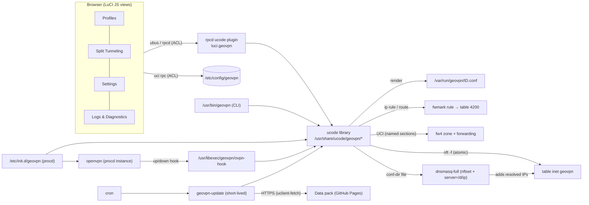
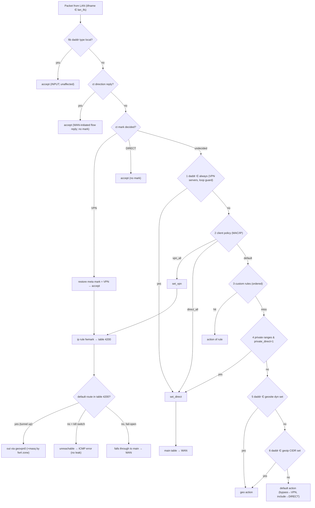

# GeoVPN — OpenVPN client with geo-based split tunneling for OpenWrt 25.12

**PLAN.md · version 1.0 · written 2026-10-05**
Working name: **GeoVPN** (package prefix `geovpn`, LuCI app `luci-app-geovpn`). Rename freely; see OQ-01.

**How to read this document.** Every technical statement carries one of three tags:

| Tag | Meaning |
|---|---|
| **[V]** | *Verified* against a source linked in §3.1 during planning (2026-10-05). |
| **[R]** | *Recommendation / design decision* made by this plan. Justified where non-obvious. |
| **[A]** | *Assumption*, not verified. Every [A] has a matching entry `V-nn` in the Verification Checklist (§3.2) that the implementer must close and record in `DECISIONS.md`. |

Code blocks are **reference examples**, not final code. Anything in them that touches an external tool's syntax is covered by a `V-nn` item.

---

## 1. Executive Summary & Goals / Non-Goals

### 1.1 Summary
GeoVPN is an installable OpenWrt package set that turns a small router into a **split-tunnel OpenVPN client managed entirely from LuCI**. The user imports an `.ovpn` file, ticks countries (GeoIP, e.g. `IR`) and domain categories (GeoSite, e.g. `category-ir`), presses *Start*, and the router sends **matching traffic directly via WAN and everything else through the VPN** (or the inverse). It works for all LAN clients, handles domain-based rules through DNS-driven nftables sets, prevents DNS/IPv6 leaks, and offers an optional kill switch.

### 1.2 Goals
- G1. One command installs everything: `apk add geovpn` ([R] meta-package) → new LuCI menu **VPN → GeoVPN**.
- G2. Correct **domain-based** (GeoSite) and **IP-based** (GeoIP) split routing for LAN clients, IPv4 and IPv6.
- G3. Lean: no resident daemon of our own, no compiled code, small flash and RAM footprint; works comfortably on a 716 MHz quad Cortex-A7 / 512 MB device.
- G4. Safe by construction: the router stays reachable (LAN/SSH/LuCI) and — unless the user opted into the kill switch — keeps its internet after any failure.
- G5. Data (GeoIP/GeoSite) is fetched **selectively** (only chosen categories), verified, atomically installed, and rolled back on failure.
- G6. English + Persian UI and documentation.

### 1.3 Non-Goals (v1)
- NG1. Not a general multi-VPN / multi-WAN manager (use `mwan3`/`pbr` for that). **One active tunnel at a time** (C-03).
- NG2. Not an ad blocker or DNS filter (`category-ads*` is usable only as a *routing* category; for blocking use `adblock-fast`).
- NG3. No WireGuard/other protocols. No transparent proxy cores (xray/sing-box/mihomo).
- NG4. No parsing of protobuf `.dat` files **on the router** (done offline in CI, §6).
- NG5. No guarantee against clients that bypass the router's DNS (DoH/DoT to the internet); mitigations are provided, not absolute (§5.6).
- NG6. No OpenWrt < 25.12 (no `opkg` support) in v1; the code is `noarch` and *may* work elsewhere, untested.

---

## 2. Requirements

### 2.1 Functional
| ID | Requirement |
|---|---|
| FR-01 | Create, edit, delete, enable/disable multiple OpenVPN client profiles. |
| FR-02 | Import `.ovpn` by paste or file upload; extract inline `<ca> <cert> <key> <tls-auth> <tls-crypt> <tls-crypt-v2> <extra-certs>`, `auth-user-pass`, `remote`, `proto`, cipher/auth options; unknown or dangerous directives are dropped and **reported**, never silently executed. |
| FR-03 | Start / stop / restart the connection; show state (connected/connecting/disconnected/error), assigned IPv4/IPv6, uptime, RX/TX counters, last log lines. |
| FR-04 | Supervised by procd; autostart on boot; automatic reconnect (OpenVPN `ping-restart` + procd respawn + WAN-up trigger). |
| FR-05 | Keys/credentials stored root-only (dirs `0700`, files `0600`); never returned by any API, never logged. |
| FR-06 | Split tunneling can be enabled/disabled; **mode `bypass`** (listed → direct, rest → VPN) and **mode `include`** (listed → VPN, rest → direct). |
| FR-07 | GeoIP entries: ISO-3166 country codes, built-in `PRIVATE`, and any other category published by the data pack. |
| FR-08 | GeoSite entries: domain categories (with optional attribute filter, e.g. `apple@cn`) published by the data pack. |
| FR-09 | Custom rules: IPv4/IPv6 address or CIDR, domain (suffix match); each with action `direct`/`vpn`, ordered, individually enable-able. |
| FR-10 | Per-LAN-client policy by IP/CIDR or MAC: `default` / `vpn_all` / `direct_all`. |
| FR-11 | The VPN server address(es) are always routed directly (loop prevention), including when `remote` is a hostname (re-resolved on WAN change). |
| FR-12 | Policy applies to LAN clients (router as gateway). Router-originated traffic: default = only DNS upstream queries and data updates are policy-routed; optional `router_traffic=policy` applies full policy (§5.5). |
| FR-13 | Domain-based matching via dnsmasq `nftset` populating nftables sets (§5.4). |
| FR-14 | Geo data: manual "Update now", scheduled update (cron), integrity verification, atomic swap, rollback, last-update display, source selection. |
| FR-15 | IPv4 and IPv6 supported; if the tunnel has no IPv6, IPv6 that should use the VPN is **rejected** (no leak) — setting `ipv6=auto|block|vpn|direct`. |
| FR-16 | Optional kill switch: VPN-bound flows are blocked (not leaked) while the tunnel is down; direct flows unaffected. |
| FR-17 | DNS: the resolver path follows the traffic path (direct domains → direct DNS, VPN domains → DNS through the tunnel); optional DNS hijack of LAN port 53, optional block of DoT; handling of server-pushed DNS. |
| FR-18 | Coexists with fw4/nftables, netifd, masquerade, MSS clamping; detects and warns on `pbr`/`mwan3`/mark collisions. |
| FR-19 | LuCI: new menu with tabs **Profiles**, **Split Tunneling**, **Settings**, **Logs & Diagnostics**. |
| FR-20 | Split tab: enable, mode, GeoIP/GeoSite lists with search/autocomplete from the catalog, custom rules, client policies, update controls, status/diagnostics (set sizes, counters), **"Test a domain/IP: which path?"** tool. |
| FR-21 | ACL JSON least-privilege; validation on client and server for every input. |
| FR-22 | i18n: `.pot` + English source strings + Persian (`fa`) `.po`; RTL-safe layout. |
| FR-23 | UI stays usable on low-power routers: paginated/searchable lists, lazy loading, no large lists pushed to the browser. |
| FR-24 | Single-command install through a meta-package; verified install path documented. |
| FR-25 | Clean uninstall; settings and profiles survive `sysupgrade -k`; data cache is re-creatable. |
| FR-26 | CLI parity: `geovpn {start,stop,restart,status,test,update,panic,diag}` for headless use. |
| FR-27 | Fail-safe: a failed start/apply performs full rollback of nft/ip/dnsmasq changes; `geovpn panic` removes all GeoVPN rules in one step. |

### 2.2 Non-functional
| ID | Requirement |
|---|---|
| NFR-01 | Installed size: `geovpn-core` + `luci-app-geovpn` + `fa` i18n ≤ **500 KB** (excluding dependencies and data). |
| NFR-02 | No GeoVPN resident process besides `openvpn` (procd instance) and `crond`/`dnsmasq`/`rpcd` that already exist. Update/test jobs are short-lived. |
| NFR-03 | Peak extra RAM during data update ≤ **24 MB**; steady-state kernel set memory for the default profile (IR + 3 categories) ≤ **8 MB** [A→V-19]. |
| NFR-04 | Apply/reload for default config ≤ **5 s**; dnsmasq restart ≤ 2 s [A→V-19]. |
| NFR-05 | No secret in logs, UI, rpc output, or world-readable files. |
| NFR-06 | All scripts idempotent; shell passes `shellcheck`; ucode passes `ucode -c` and project lint; no `eval`, no unquoted expansions. |
| NFR-07 | Flash wear: runtime state only in `/var` (tmpfs); data written only when content hash changes; ≤ 1 data write cycle per day. |
| NFR-08 | nftables/fw4 only (no iptables). `apk` only (no `opkg` code paths). |
| NFR-09 | Primary target: OpenWrt 25.12.x on `ipq40xx/chromium` (Google WiFi AC-1304). All packages `noarch`, so other targets are expected to work but are best-effort. |
| NFR-10 | No command injection, no path traversal (§12). |
| NFR-11 | Observability: syslog tag `geovpn`, nft counters, structured `status` JSON. |
| NFR-12 | Upgrade-safe: `option config_version` + migration in `/etc/uci-defaults`. |
| NFR-13 | RTL/LTR-safe rendering of IPs, CIDRs, domains in Persian UI. |

### 2.3 Constraints
| ID | Constraint |
|---|---|
| C-01 | The repository contains **no compiled code**; all packages are `PKGARCH:=all`. |
| C-02 | Dependencies only from official OpenWrt feeds. |
| C-03 | v1 supports exactly **one active tunnel**. |
| C-04 | Geo data pack and upstream licenses must be preserved and displayed (§6.6). |

---

## 3. Research Findings & Verified Facts

### 3.1 Verified facts (with sources)

| # | Fact | Tag | Source |
|---|---|---|---|
| F-01 | Current stable series is **OpenWrt 25.12**; latest release found on the downloads page is **25.12.5** (released 2026-06-29; announced 2026-07-01); kernel 6.12.x. | [V] | https://downloads.openwrt.org/ · https://forum.openwrt.org/t/openwrt-25-12-5-service-release/251479 |
| F-02 | 25.12.0+ uses **`apk`** instead of `opkg`. Upgrades 24.10→25.12 are "mostly transparent"; 23.05→25.12 sysupgrade is not officially supported. | [V] | https://en.wikipedia.org/wiki/OpenWrt · https://openwrt.org/releases/25.12/notes-25.12.3 |
| F-03 | Google WiFi (AC-1304): target **`ipq40xx`**, subtarget **`chromium`** (*not* `generic`), package arch `arm_cortex-a7_neon-vfpv4`, supported since 23.05, IPQ4019 quad Cortex-A7 @ ~716 MHz. | [V] | https://techinfodepot.shoutwiki.com/wiki/Google_Wifi_(AC-1304) |
| F-04 | Google WiFi has **512 MB RAM and 4 GB eMMC** (not small NOR/NAND). The sysupgrade image is only ~8.7 MB, so the scarce resources are CPU and (moderately) RAM, not flash. | [V] | https://github.com/kkestell/openwrt-on-google-wifi · https://archive.openwrt.org/releases/25.12.2/targets/ipq40xx/chromium/ |
| F-05 | SDK file name pattern: `openwrt-sdk-<ver>-ipq40xx-chromium_gcc-14.3.0_musl_eabi.Linux-x86_64.tar.zst` under `https://downloads.openwrt.org/releases/<ver>/targets/ipq40xx/chromium/`. | [V] | https://archive.openwrt.org/releases/25.12.2/targets/ipq40xx/chromium/ |
| F-06 | Custom apk feed = key file in `/etc/apk/keys/` + a line with the URL of `packages.adb` in `/etc/apk/repositories.d/*.list`. Keys in `/etc/apk/keys` do **not** survive sysupgrade unless listed in `/etc/sysupgrade.conf`. | [V] | https://forum.openwrt.org/t/the-future-is-now-opkg-vs-apk/201164/501 · https://github.com/ly4096x/my-openwrt-packages |
| F-07 | `apk add --allow-untrusted <file.apk>` installs unsigned/untrusted local packages. | [V] | https://man.archlinux.org/man/apk (apk-tools manual) · OpenWrt forum threads |
| F-08 | apk does not follow HTTP redirects for feed URLs (openwrt#17180) → **GitHub Releases asset URLs cannot be used as a feed**; use GitHub Pages / static host. Secondary source (third-party tool docs). | [V] (secondary) | https://pkg.go.dev/github.com/VizzleTF/owfeed@v0.1.4 |
| F-09 | **fw4 only flushes/rewrites its own `table inet fw4`** (`table inet fw4; flush table inet fw4; table inet fw4 {…}`), so a separate table of ours survives `fw4 reload`. fw4 include points: `/usr/share/nftables.d/{ruleset-pre,ruleset-post,table-pre,table-post,chain-pre/<chain>,chain-post/<chain>}/*.nft`. | [V] | https://forum.openwrt.org/t/firewall4-nftables-tips-and-tricks/113704/8 · https://lxr.openwrt.org/source/firewall4/root/usr/share/nftables.d |
| F-10 | dnsmasq `--nftset=/domain/4#inet#table#set` (family prefix `4#`/`6#`, then `family#table#set`) exists since dnsmasq 2.87; requires **dnsmasq-full**. | [V] | https://lists.thekelleys.org.uk/pipermail/dnsmasq-discuss/2021q3/015680.html · https://docs.openwrt.melmac.ca/pbr/ |
| F-11 | OpenWrt runs dnsmasq in a **ujail**; extra config files must live in the instance's `confdir` (the jail mounts it). The default confdir became **per-instance** (`/tmp/dnsmasq.<cfg>.d`, older: `/tmp/dnsmasq.d`) — must be detected at runtime. | [V] | https://forum.openwrt.org/t/dnsmasq-not-include-configuration-from-additional-file/250285 · https://git.openwrt.org/bd81d97e19e6cc6e33dc5ff852ece95bbc6be01e |
| F-12 | dnsmasq's nftset only fills when **the router itself resolves** the name (clients using other resolvers/DoH never populate sets). With CNAME chains, results are processed for the queried name and the CNAME. | [V] | https://forum.openwrt.org/t/how-to-route-subdomains-with-pbr-utilize-dnsmasq-s-nft-sets-support/231943 · https://forum.openwrt.org/t/nftables-filtering-traffic-at-ip-addresses-level-based-on-relevant-domain-name/126182/15 |
| F-13 | `pbr` 1.2.2-r6 ships in 25.12; it uses `dnsmasq.nftset` and by default marks with mask `0x00ff0000` (`uplink_mark 0x00010000`), rule priority around 30000 → **our mark/mask/priority must not collide**. | [V] | https://github.com/openwrt/packages/pull/28642 · https://forum.openwrt.org/t/policy-based-routing-pbr-package-discussion/140639/2854 |
| F-14 | 25.12.x ships **OpenVPN 2.7.x** (`openvpn-openssl`, `-mbedtls`; `-wolfssl` disabled upstream on master due to breakage); DCO via `kmod-ovpn-dco-v2` / `kmod-ovpn-backports` is optional and has option restrictions; **`luci-proto-openvpn` is master-only**, release images use `luci-app-openvpn`. | [V] | https://github.com/openwrt/packages/blob/master/net/openvpn/Makefile · https://forum.openwrt.org/t/slow-openvpn-25-12-4/250425 · https://forum.openwrt.org/t/problems-with-openvpn-openssl-and-luci-proto-openvpn/250910 |
| F-15 | Modern LuCI app layout: `htdocs/luci-static/resources/view/<app>/*.js`, `root/usr/share/luci/menu.d/luci-app-<app>.json`, `root/usr/share/rpcd/acl.d/luci-app-<app>.json`, `root/usr/share/rpcd/ucode/<app>.uc`, `po/templates/<app>.pot`, `root/etc/uci-defaults/NN_<app>`. Missing ACL → "Access denied"; fix by restarting `rpcd`. | [V] | https://git-03.infra.openwrt.org/project/luci/plain/applications/luci-app-example/structure.md |
| F-16 | Data sources: **ipverse/country-ip-blocks** — per-country `ipv4-aggregated.txt`/`ipv6-aggregated.txt` on raw.githubusercontent.com + bulk tar.gz, license **CC0 1.0**. **Loyalsoldier/v2ray-rules-dat** — `geoip.dat` ≈15.8 MB, `geosite.dat` ≈10.5 MB (2026-10-03), license **GPL-3.0**, built from v2fly/domain-list-community. **Chocolate4U/Iran-v2ray-rules** adds `geosite:ir`, `geosite:category-ir`, `geoip:ir`. | [V] | https://github.com/ipverse/country-ip-blocks · https://github.com/Loyalsoldier/v2ray-rules-dat/releases · https://github.com/Chocolate4U/Iran-v2ray-rules |

### 3.2 Assumptions & Verification Checklist
Each item must be closed during implementation; the result (verified / corrected / blocked) is written to `DECISIONS.md` with the command output or link used.

| ID | What to verify | Where it matters |
|---|---|---|
| V-01 | Latest 25.12.x at implementation time (pin SDK + test image to it; keep a matrix with the previous one). | §14 |
| V-02 | Existence and exact names in 25.12 `ipq40xx/chromium` feeds: `openvpn-openssl`, `kmod-tun`, `dnsmasq-full`, `ip-full`, `firewall4`, `nftables-json`, `ucode`, `ucode-mod-fs`, `ucode-mod-uci`, `ucode-mod-ubus`, `ucode-mod-uloop`, `ucode-mod-resolv`, `rpcd`, `rpcd-mod-ucode`, `luci-base`, `uclient-fetch`, `libustream-mbedtls`/`-openssl`, `ca-bundle`, `usign`, `cron`/busybox crond, `conntrack` (optional). Flag anything missing. | §8 |
| V-03 | apk behavior when a package `DEPENDS:+dnsmasq-full` while `dnsmasq` is installed (`CONFLICTS`/`PROVIDES`): error text, and the safe swap procedure (fetch → del → add). | §8, README |
| V-04 | `PKGARCH:=all` produces an apk with arch `noarch` that installs on `arm_cortex-a7_neon-vfpv4`. | §8, §14 |
| V-05 | Whether `default_postinst`/uci-defaults runs immediately on `apk add` on a live system (needed for first-time config creation), and how to trigger it otherwise. | §8 |
| V-06 | dnsmasq `confdir` discovery method (read `conf-dir=` from `/var/etc/dnsmasq.conf.*`) and that files there are readable in the jail; reload semantics (restart required for new conf-dir files). | §10.10 |
| V-07 | dnsmasq version in 25.12 (≥ 2.87), combined `nftset=/d/4#inet#geovpn#a,6#inet#geovpn#b` syntax, element timeout behavior (TTL vs. set default), behavior for cached answers and CNAMEs. | §5.4, §10.10 |
| V-08 | nft: `reject` allowed in a `forward`-hook chain at `priority filter - 1`; `type route hook output` re-routing after mark change; `fib daddr type local`; `ct mark` mask arithmetic syntax. | §10.7 |
| V-09 | `rp_filter` defaults on 25.12 and need for `rp_filter=2` on the tunnel device. | §10.8 |
| V-10 | Interaction of fw4 software/hardware **flow offloading** with fwmark policy routing (decision cached per flow). | §10.8 |
| V-11 | Mark/priority collisions: `pbr` (0x00ff0000), `mwan3` (0x3F00), Tailscale, others; chosen defaults `0x0f000000`/prio 700. | §9 |
| V-12 | fw4 zone with `list device 'geovpn0'` (no netifd interface) + `masq`, `mtu_fix`, and a `forwarding` from `lan`. | §10.9 |
| V-13 | LuCI `menu.d` merge behavior for the shared `admin/vpn` node (coexisting with `luci-app-openvpn`); fallback `admin/services/geovpn`. | §11.1 |
| V-14 | rpcd ucode plugin contract in 25.12 (`return { 'luci.geovpn': methods }`, `args`, `call(req)`, error returns), long-running call limits, and how to detach background jobs. | §10.12 |
| V-15 | `uclient-fetch` HTTPS + redirect behavior with GitHub Pages and raw.githubusercontent.com; required `libustream-*`. | §10.11 |
| V-16 | `usign -V -m <file> -P <keydir>` syntax and key format; availability of `usign` in 25.12 images. | §6.4 |
| V-17 | OpenVPN directive set: `route-nopull`, `pull-filter ignore`, `up`/`down` env vars (`foreign_option_N`, `ifconfig_ipv6_local`, `dev`), `dev geovpn0` + `dev-type tun`, `syslog`, DCO incompatibilities; whether `redirect-gateway` is ignored by `route-nopull`. | §10.4 |
| V-18 | Real OpenVPN throughput on the AC-1304 for AES-128-GCM / AES-256-GCM / CHACHA20-POLY1305 (expected tens of Mbit/s; **measure**). | §13 |
| V-19 | `nft -f` load time/memory for 1k / 10k / 50k / 100k interval elements and 5k/20k/50k dnsmasq domains on the device. Replace budget numbers in §13 with measurements. | §13 |
| V-20 | Free space on overlay of a fresh 25.12 install on the device; confirm eMMC-backed overlay and its size. | §4 |
| V-21 | Licenses: v2fly/domain-list-community (expected MIT), Chocolate4U (expected GPL-3.0), runetfreedom; what must be shipped in the pack's `LICENSES/`. | §6.6 |
| V-22 | `nft get element inet geovpn <set> { addr }` works for interval sets (used by the test tool); fallback `nft list set` + CIDR match in ucode. | §10.12 |
| V-23 | `apk fetch` default output directory (cwd) and file naming; `apk del`/`apk add ./x.apk` trust for official packages. | README |
| V-24 | `cron` service enabled by default and crontab path `/etc/crontabs/root`. | §10.11 |
| V-25 | `/lib/upgrade/keep.d/` semantic for preserving `/etc/geovpn/profiles` across `sysupgrade -k`; interaction with apk `conffiles`. | §8 |
| V-26 | Package-name collision search: `geovpn`, `luci-app-geovpn` in all feeds. | §8 |
| V-27 | LuCI RTL support in the active theme(s) for `fa`; document gaps. | §11.6 |
| V-28 | Apk signing: how the SDK signs packages, `apk mkndx`/`apk adbsign` flags, key format (`.pem`), and what clients need in `/etc/apk/keys`. | §14.3 |
| V-29 | Docker/QEMU images for tests (`openwrt/rootfs`, x86/64 combined image) availability for 25.12.x. | §15 |
| V-30 | `ip rule … uidrange`/`oif` alternatives not needed; confirm `ip-full` provides `ip -6 rule`, `ip route … unreachable` in table form used here. | §10.8 |

---

## 4. Hardware / OS Analysis (Google WiFi AC-1304 on OpenWrt 25.12)

### 4.1 Corrections to the project brief [V]
- The device is **`ipq40xx/chromium`**, not `ipq40xx/generic` (F-03). SDK/CI/feed paths must use `chromium` (F-05).
- Storage is **4 GB eMMC** and the sysupgrade image is ~8.7 MB (F-04). Flash is *not* the binding constraint; **CPU (716 MHz A7) and RAM (512 MB, shared with Wi-Fi and conntrack)** are. We still keep the footprint small (NFR-01) because the same package is meant to run on smaller devices.
- Package manager is `apk`, firewall is `fw4`/nftables only (F-02, F-09).

### 4.2 Resource model [A→V-18, V-19, V-20]
| Resource | Figure | Consequence |
|---|---|---|
| CPU | 4 × Cortex-A7 @ ~716 MHz, NEON, **no ARMv8 crypto extensions** | OpenVPN is single-threaded in userspace: expect tens of Mbit/s, not hundreds. Prefer `CHACHA20-POLY1305` (if the server supports it) or AES-GCM with the OpenSSL build; **measure** (V-18). DCO (kernel offload) is *optional/off by default* because of option restrictions and 25.12.4 reports of problems [V: F-14]. |
| RAM | 512 MB | Large nft interval sets (10⁵ elements ≈ low tens of MB) and 5×10⁴ dnsmasq domains are affordable; hard caps still enforced (§13). |
| Storage | 4 GB eMMC, overlay on eMMC | Daily 1–3 MB data writes are harmless; still minimize (NFR-07). |
| Network | 2 GbE ports, 1 USB-C | Typical home topology: `wan` + `br-lan`. |

### 4.3 Kernel / userland pieces needed
`kmod-tun` (OpenVPN TUN), nf_tables core with `ct`, `meta`, `lookup`, `fib`, `reject`, `redirect` (shipped with `firewall4`'s dependencies, [A→V-02]), `ip-full` (policy routing for `ip rule`/IPv6 tables, [A→V-30]), `dnsmasq-full` (nftset), `ucode` + modules, `uclient-fetch` + TLS lib + `ca-bundle`, `usign` (signature verification of data packs).

### 4.4 apk and fw4 specifics that shape the design
- Packages are `.apk`; local install of our own builds needs `--allow-untrusted` unless our signing key is installed in `/etc/apk/keys` (F-06, F-07). The feed key must be added to `/etc/sysupgrade.conf` or it disappears on sysupgrade (F-06).
- Feeds must be served from a host that doesn't redirect (F-08) → GitHub **Pages** for the feed; Releases for convenience downloads only.
- Because fw4 rewrites only `table inet fw4` (F-09), GeoVPN uses its **own table `inet geovpn`**. That keeps our dynamic sets alive across `fw4 reload` and avoids editing fw4's generated ruleset. Only a firewall *zone + forwarding* is registered via UCI (so LuCI's firewall page shows it and masquerade/MSS fix are done by fw4).
- `dnsmasq-full` replaces `dnsmasq` (conflicting packages). Swap must be done **while the network still works** (fetch first, then delete, then add) — README §"Prerequisites".

---

## 5. Architecture

### 5.1 Components


### 5.2 Core idea [R]
1. **Classification in nftables** (`table inet geovpn`, prerouting at `mangle` priority) decides per *connection* whether a flow is `VPN` or `DIRECT`, stores the decision in a masked bit-field of `ct mark`, and sets the packet `meta mark` for VPN flows.
2. **Policy routing**: `ip rule fwmark 0x01000000/0x0f000000 lookup 4200 priority 700`; table 4200 holds `default dev geovpn0` (when up) and optionally `unreachable default` (kill switch).
3. **Everything else uses the unmodified main routing table** (WAN). Therefore "direct" needs no routes and "VPN server unreachable through itself" is impossible by construction (its address is in the *always-direct* set).
4. **Domain matching** is DNS-driven: dnsmasq resolves for the LAN and, for every domain in the generated list, inserts the answer IPs into `inet geovpn` sets (`nftset`). The same domain list also pins *which upstream DNS* is used for that domain (direct vs. through tunnel).
5. **GeoIP** categories are static CIDR lists loaded into interval sets.

### 5.3 Packet flow (LAN client → Internet)

`guard` chain in `forward` hook (priority `filter - 1`) is a second line of defense: any packet carrying the VPN mark that is about to leave through an interface other than `geovpn0` is rejected when `kill_switch=1`; with `ipv6=block|auto(no v6)` VPN-marked IPv6 is rejected [A→V-08].

### 5.4 Domain/IP matching: options compared and the decision

| Option | Accuracy | RAM | CPU | Leaks / bypass | TTL | IPv6 | Complexity |
|---|---|---|---|---|---|---|---|
| **A. dnsmasq-full `nftset` (+ `server=/d/ip`)** — domain→IP sets filled at resolution | Good for names resolved by the router; suffix semantics | Low (domains in dnsmasq, IPs in nft sets) | Very low (kernel lookup) | Clients with DoH/own resolver miss sets (mitigations §5.6) | Set `timeout` per element/default | `6#` sets | **Low** |
| B. Pre-resolve domains on the router (cron) into sets | Poor (CDN IPs change, wildcards impossible) | Medium | Periodic bursts | No dependency on client DNS, but stale | Manual | Doubles queries | Medium |
| C. Local smart DNS (smartdns / own resolver) | Good | Medium (+1 daemon) | Medium | Same client-DNS caveat | Fine-grained | Yes | High, new dependency |
| D. Transparent proxy core with native geosite (xray/sing-box/mihomo) | Very good (SNI sniffing, regex/keyword) | High (large dat in RAM) | High on A7 | Handles DoH via sniffing | n/a | Yes | Very high; not OpenVPN |
| E. `route net_gateway` entries in OpenVPN for every CIDR | IP-only | Medium/High (kernel routes) | Low | No domain support | n/a | Awkward | Medium; fails for large countries |

**Decision [R]: Option A as the single primary architecture.** It adds no resident component, reuses the dnsmasq already on the router, keeps domain data in a form (suffix lists) that dnsmasq natively supports, and makes *DNS path = traffic path* trivial because the same domain list drives both `nftset=` and `server=/d/ip`.
**Rejected:** B (inaccurate for CDNs/wildcards), C and D (extra daemon/RAM/CPU on a 716 MHz CPU; D abandons the OpenVPN requirement), E (cannot express domains; route table bloat for CN/RU/US-sized lists).
**Known semantic limits** [R], surfaced in the UI/README: dnsmasq matches **suffix only** — GeoSite `full:` entries are widened to suffix; `keyword:` and `regexp:` rules cannot be expressed and are dropped at pack-build time (counted per category in the catalog). IP sharing between a direct and a VPN domain on the same CDN IP is resolved by rule precedence (§5.3).

**Alternative considered: depend on `pbr`.** `pbr` already does fwmark+nftset routing [V: F-13] but is generic, has no OpenVPN lifecycle, no GeoIP/GeoSite catalog, no per-domain DNS-path pinning and no kill-switch semantics we need. Reimplementing the thin routing layer (≈ 300 lines of nft/ip generation) costs less than bending `pbr` and avoids a runtime dependency. GeoVPN **detects `pbr`/`mwan3` and warns** (§10.14); it uses a disjoint mark/mask/priority.

### 5.5 Router-originated traffic [R]
Default `router_traffic='dns'`: only (a) DNS queries from dnsmasq to resolvers in `dns_vpn4/6` and (b) data-update fetches to hosts in `fetch_vpn4/6` (when `update_via=vpn`) are marked into the tunnel by an `output`-hook chain (`type route`). All other router traffic (NTP, apk, OpenVPN's own transport) is unaffected and goes via WAN. Optional `router_traffic='policy'` runs the same classifier on the router's own packets (excluding the OpenVPN transport thanks to the *always-direct* set). Rationale: least surprise, zero risk of tunnel-over-tunnel loops.

### 5.6 DNS flow and leak prevention
```
LAN client ──UDP/TCP 53──► dnsmasq-full (router)                      [DNS hijack: LAN :53 → router, optional]
                           │
                           ├─ domain ∈ geo list (action=direct)  ─► server=/domain/<direct DNS>  (WAN, unmarked)
                           │       └─ answer IPs → nftset (sets d* / v*) for routing
                           ├─ domain ∈ geo list (action=vpn)     ─► server=/domain/<VPN DNS>     (marked → table 4200 → tunnel)
                           ├─ VPN server hostname / data hosts   ─► server=/host/<direct DNS> + nftset → always-direct set
                           └─ everything else (default path)     ─► bypass mode : VPN DNS  (no-resolv + server=<VPN DNS>)
                                                                    include mode: untouched dnsmasq defaults (ISP/WAN DNS)
```
Rules [R]:
- **DNS path follows traffic path.** Default path in `bypass` mode is *through the tunnel*; `no-resolv` is emitted so ISP resolvers are not raced (a persistent conf-dir file, so it applies at every dnsmasq start).
- VPN DNS servers = `dns_vpn_servers` (public resolver IPs, default `1.1.1.1 9.9.9.9`) and/or the token `pushed` (server-pushed DNS captured by the `up` hook). They are placed in `dns_vpn4/6` so the `output` chain marks DNS packets toward them into table 4200. With the kill switch on, they fail closed.
- Direct DNS = `dns_direct_servers`, default token `auto` = resolvers from the WAN's `/tmp/resolv.conf.d/resolv.conf.auto`, regenerated on WAN `ifup` hotplug only if the set changed.
- Pushed private DNS addresses (e.g. 10.8.0.1) are valid only while the tunnel is up; on `up`/`down` the hook regenerates the dnsmasq file **only if it changed** and restarts dnsmasq.
- **DoH/DoT/own-resolver bypass** (clients not using the router's DNS) cannot populate sets. Mitigations (all optional, in Settings): `dns_hijack` (redirect LAN :53 to the router, default **on**), `block_dot` (drop LAN → :853, default **on**), `block_doh` (drop LAN → :443 to a curated resolver-IP list shipped in the pack, default **off**, may break apps), documented browser setting / canary-domain `use-application-dns.net` NXDOMAIN (`dns_canary=1`, default on).
- IPv6 DNS: the router advertises itself as RDNSS/DHCPv6 DNS (OpenWrt default) → same dnsmasq. AAAA answers populate `6#` sets.

### 5.7 IPv6 [R]
`ipv6='auto'` (default): if the up-hook sees `ifconfig_ipv6_local` (tunnel carries IPv6) → install `default dev geovpn0` in the **v6** table 4200 and treat IPv6 like IPv4. Otherwise → table 4200 gets `unreachable default` for v6 **and** the `guard` chain rejects VPN-marked IPv6 (`reject with icmpv6 addr-unreachable`/admin-prohibited), so clients fall back to IPv4 within milliseconds (Happy Eyeballs) — no leak, no hang. `direct` IPv6 flows are never touched. `ipv6='vpn'` forces v6 through the tunnel (user asserts support); `ipv6='direct'` disables v6 policy (unsafe; warns); `ipv6='block'` always rejects VPN-bound v6.

### 5.8 Kill switch [R]
Fail-closed is implemented by **routing** (primary) and **filtering** (belt and braces):
- Table 4200 always contains `unreachable default metric 4000` (v4 and v6) when `kill_switch=1`; the tunnel adds `default dev geovpn0 metric 10`. Marked packets with no tunnel route get ICMP *unreachable* instead of falling through to the main table.
- Rules are installed **before** OpenVPN starts (no boot-time leak window).
- `guard` chain rejects VPN-marked packets leaving through any device other than the tunnel.
- DIRECT flows (including the VPN transport itself) never carry the mark → unaffected.
- With `kill_switch=0` (default) the `unreachable` route is absent; marked packets fall through to `main` → **fail-open** (internet keeps working directly while the VPN is down). The UI states this explicitly next to the toggle.

### 5.9 Interaction with the rest of the system
| Component | Interaction |
|---|---|
| **fw4** | Own table `inet geovpn` (priorities: mangle prerouting, `filter-1` forward guard, `dstnat-1` DNS redirect). One UCI zone `geovpn` (`list device 'geovpn0'`, `masq 1`, `mtu_fix 1`, `input/forward REJECT`, `output ACCEPT`) + `forwarding lan→geovpn` for each `lan_zones` entry, created as **named sections** (`geovpn_zone`, `geovpn_fwd_<lan>`), removed on uninstall [A→V-12]. |
| **netifd** | Not used for the tunnel device; OpenVPN creates `geovpn0` directly. LAN device names are *read* from `network.*` for `lan_ifs` default. WAN `ifup` hotplug refreshes direct DNS and re-resolves VPN hostnames. |
| **mwan3** | If running → warning + `conflicts` banner. Mark mask `0x3F00` (mwan3) vs ours `0x0f000000` do not overlap; rule priority 700 sits before mwan3's 1000+ rules [A→V-11]. Supported only for single-uplink use in v1. |
| **pbr** | If running → warning. Different mask (0x00ff0000 vs ours) and priority [V: F-13]. Do not assign the same destination to both. |
| **MSS** | `mtu_fix` in the fw4 zone; OpenVPN `mssfix` set from profile (default 1450 when unset). |
| **Flow offloading** | If `firewall.@defaults[0].flow_offloading` is on, diagnostics warn until V-10 is resolved. |
| **rp_filter** | `up` hook sets `net.ipv4.conf.geovpn0.rp_filter=2` (loose) since replies from Internet hosts arrive on `geovpn0` while the main table would route back via WAN [A→V-09]. |

---

## 6. Data Design

### 6.1 What the router needs
- **GeoIP**: for each selected category, a plain list of CIDRs (v4, v6).
- **GeoSite**: for each selected category, a plain list of domain suffixes.
- **Catalog**: names, counts and hashes of everything available, to power autocomplete and size warnings.
No protobuf, no `.dat` parsing, no regex on the router.

### 6.2 Source evaluation
| Source | Content | Size | License | Verdict |
|---|---|---|---|---|
| ipverse/country-ip-blocks [V] | per-country v4/v6 CIDR lists, daily, from RIR data | few KB–MB per country | **CC0** | **Primary GeoIP source.** Per-country files = selective download for free. |
| v2fly/domain-list-community (`data/*`) | ~1.4k categories; `domain:`, `full:`, `keyword:`, `regexp:`, `include:`, `@attr` | repo ~10 MB | MIT [A→V-21] | **Primary GeoSite source** (compiled in CI). |
| Loyalsoldier/v2ray-rules-dat [V] | `geoip.dat` 15.8 MB, `geosite.dat` 10.5 MB, extras (e.g. `gfw`, `cn` enhancements) | 26 MB total | **GPL-3.0** | Optional *extra pack*, fetched by the user's router from upstream or ingested by CI as a separate pack; never bundled into our base pack. |
| Chocolate4U/Iran-v2ray-rules [V] | dlc + `ir`, `category-ir`, IR geoip | `.dat` | [A→V-21] | Recommended *extra pack* for Iranian users (`ir` list richer than upstream dlc). |
| MaxMind GeoLite2 | country DB | MB | CC BY-SA 4.0 + EULA + login | **Rejected** (account/licensing friction, binary format). |
| DB-IP Lite | country DB | MB | CC BY 4.0 | Rejected for v1 (binary/CSV conversion, attribution). Possible later. |
| Full `.dat` on router | all categories | 26 MB flash + RAM parse | n/a | **Rejected** (parser dependency, RAM). |

### 6.3 Strategy: "compile in CI, ship per-category flat files"
A separate repo/directory `geovpn-data/` has a GitHub Actions job (nightly) that:
1. Downloads upstream sources at pinned/recorded commits (ipverse tarball, dlc `data/`; optional `.dat` packs via a Go/Python extractor).
2. Resolves `include:` recursively, applies attributes (`apple@cn` → separate file), lowercases, IDNA-normalizes, deduplicates, **collapses redundant subdomains** (if `a.com` is present, `b.a.com` is removed), drops `keyword:`/`regexp:` (recording counts), caps each category at 200k lines.
3. Emits the **pack** (static files, served by GitHub Pages):
```
pack/
  MANIFEST                 # schema=1, build_id, build_time, sources{name→commit}, sha256 of catalogs, license list
  MANIFEST.sig             # usign signature of MANIFEST (key shipped with geovpn-core)
  catalog/geoip.tsv        # code <TAB> v4_count <TAB> v6_count <TAB> sha256_v4 <TAB> sha256_v6 <TAB> bytes_v4 <TAB> bytes_v6
  catalog/geosite.tsv      # name <TAB> domain_count <TAB> sha256 <TAB> bytes <TAB> dropped_kw_re <TAB> attrs
  ip/ir.v4.txt  ip/ir.v6.txt  ...        # one CIDR per line, aggregated
  site/category-ir.txt  site/apple@cn.txt ...   # one domain suffix per line
  misc/doh-resolvers.txt   # curated resolver IPs for block_doh
  LICENSES/                # upstream license texts and attribution
```
File names are sanitized (`[a-z0-9@._-]`, `!` → `not-`, e.g. `geolocation-!cn` → `geolocation-not-cn`; the catalog keeps a `display` column).
4. `MANIFEST` pins the sha256 of both catalogs; each catalog row pins the sha256 of its file → a **two-level Merkle-lite** chain, so one signature covers everything and individual files can be fetched lazily.

### 6.4 Router update algorithm (atomic, with rollback) [R]
```
geovpn-update [--force] [--cron]
 1. lock (/var/run/geovpn/update.lock); jitter sleep if --cron (0–1800 s)
 2. ensure hosts reachable per update_via (direct | vpn | auto): add resolved IPs to fetch set when via VPN
 3. GET MANIFEST + MANIFEST.sig → verify with usign (pubkey /etc/geovpn/keys/pack.pub); reject if build_time < stored (downgrade guard) unless --force
 4. if build_id unchanged and no new categories requested → exit 0
 5. GET catalog/*.tsv (verify sha256 vs MANIFEST)
 6. for each *selected* category (from UCI) GET file → verify sha256 vs catalog → stage in /etc/geovpn/data.new/
 7. validate staged files (syntax of every line: CIDR / domain regex; count within caps; total caps)
 8. compose: render sets file + dnsmasq conf into /var/run/geovpn/stage/ and dry-run:  nft -c -f stage/sets.nft
 9. swap: mv data → data.prev ; mv data.new → data   (rename(2); same filesystem)
10. reload split layer (set contents replaced in one nft transaction; dnsmasq restarted only if domain list changed)
11. health check (nft table present, dnsmasq alive, resolver answers a canary query via 127.0.0.1)
12. on any failure in 6–11: restore data.prev, reload again, record error in state, keep serving the old data
13. write state (/etc/geovpn/data/STATE: build_id, time, categories, counts) and keep data.prev until next success
```
Update failure never touches the running tunnel. Categories added in the UI but not yet downloaded trigger a *selective* update of just those files. Telemetry: none.

### 6.5 Size and set budgets (defaults, enforced) [A→V-19]
| Item | Default cap | Rationale |
|---|---|---|
| Total CIDR elements (v4+v6) | 150 000 | kernel set memory ≲ 15 MB |
| Total domains | 60 000 | dnsmasq memory/startup time |
| Dynamic set size | 65 536 / family | bounded growth, `timeout` 6 h default |
| Single category | 200 000 lines | pack builder cap |
| Pack download per update | only selected categories + 2 catalogs (≈ 150–400 KB for IR + 3 categories) | |
The UI shows **estimated RAM** (elements × ~64 B, domains × ~150 B) before saving a selection and refuses selections over the caps unless `allow_large=1`.

### 6.6 Licensing notes
- Base pack = CC0 (ipverse) + MIT (v2fly dlc) derived lists. Carry the upstream license texts in `LICENSES/` and show a "Data sources & licenses" panel in Settings.
- GPL-3.0 sources (Loyalsoldier, possibly Chocolate4U) are used only as **separate extra packs** produced in a separate output directory/repo, so that licensing of the base pack stays permissive. Router code is licensed independently (OQ-05 default: Apache-2.0).
- Users may point `data_source` at any pack URL; the signature key can be replaced (`pack_pubkey`), and unsigned packs require `verify=0` (UI warning).

### 6.7 Update scheduling
Cron line managed by the init script between `# geovpn begin` / `# geovpn end` markers: default `17 4 * * *` with 0–1800 s random jitter. `auto_update=0` removes it. Manual "Update now" runs the same script detached and reports progress through `/var/run/geovpn/update.json`.

---

## 7. Package & Repository Layout

```
geovpn/                                   # git repo root
├── README.md  README.fa.md  LICENSE  CHANGELOG.md  DECISIONS.md  PLAN.md
├── openwrt/
│   ├── geovpn/Makefile                   # meta-package (no files)
│   ├── geovpn-core/
│   │   ├── Makefile
│   │   └── files/
│   │       ├── etc/config/geovpn                         # default UCI (conffile)
│   │       ├── etc/init.d/geovpn                         # procd (mode 0755)
│   │       ├── etc/uci-defaults/90-geovpn                # first-install/migration (mode 0755)
│   │       ├── etc/hotplug.d/iface/50-geovpn             # WAN ifup/ifdown (0755)
│   │       ├── etc/geovpn/keys/pack.pub                  # usign public key of default pack (0644)
│   │       ├── lib/upgrade/keep.d/geovpn                 # preserves /etc/geovpn/profiles
│   │       ├── usr/bin/geovpn                            # CLI front-end (sh → ucode) (0755)
│   │       ├── usr/bin/geovpn-update                     # updater entry (0755)
│   │       ├── usr/libexec/geovpn/ovpn-hook              # openvpn up/down hook (0755)
│   │       ├── usr/libexec/geovpn/spawn                  # double-fork launcher (0755)
│   │       ├── usr/share/ucode/geovpn/                   # library modules (0644)
│   │       │   ├── config.uc   uci load + validation + defaults
│   │       │   ├── ovpn_parse.uc   .ovpn parser/allowlist
│   │       │   ├── ovpn_render.uc  OpenVPN config renderer
│   │       │   ├── nftgen.uc   nft ruleset/sets renderer
│   │       │   ├── route.uc    ip rule / route management
│   │       │   ├── dnsgen.uc   dnsmasq conf renderer + restart logic
│   │       │   ├── fwzone.uc   fw4 zone/forwarding via uci
│   │       │   ├── data.uc     pack client, verification, staging, swap
│   │       │   ├── state.uc    /var/run state files (atomic write)
│   │       │   ├── diag.uc     diagnostics + path tester
│   │       │   └── util.uc     validators (regex), safe exec, logging
│   │       └── usr/share/geovpn/doh-resolvers.txt        # seed list (replaced by pack)
│   ├── luci-app-geovpn/
│   │   ├── Makefile                      # includes luci.mk
│   │   ├── htdocs/luci-static/resources/view/geovpn/{profiles,split,settings,logs}.js
│   │   ├── htdocs/luci-static/resources/geovpn/{api,picker,widgets}.js   # shared JS modules
│   │   ├── htdocs/luci-static/resources/geovpn/geovpn.css
│   │   ├── root/usr/share/luci/menu.d/luci-app-geovpn.json
│   │   ├── root/usr/share/rpcd/acl.d/luci-app-geovpn.json
│   │   ├── root/usr/share/rpcd/ucode/geovpn.uc
│   │   └── po/{templates/geovpn.pot, fa/geovpn.po}
│   └── geovpn-data-seed/ (optional)      # tiny offline starter data (PRIVATE + IR) so first start works offline
├── data-pack/                            # CI compiler for the data pack
│   ├── build_pack.py  requirements.txt  tests/  LICENSES/
├── tests/
│   ├── unit/        (ucode/sh unit tests with mocked fs/exec)
│   ├── integration/ (netns + OpenWrt rootfs container / QEMU harness)
│   └── device/      (manual on-device checklist + scripts)
├── tools/  lint.sh  build-sdk.sh  mk-feed.sh
└── .github/workflows/{build.yml, test.yml, data-pack.yml, release.yml}
```
Permission map is repeated in §8.5.

---

## 8. Package Definitions

### 8.1 Structure decision [R]
Three real packages + one meta-package (+ optional seed data):

| Package | Contents | Why separate |
|---|---|---|
| `geovpn-core` | init script, ucode library, CLI, hook, UCI default, hotplug | Headless/CLI use without LuCI; the part with system dependencies. |
| `luci-app-geovpn` | JS views, menu, ACL, rpcd plugin, `.pot`; auto-generated `luci-i18n-geovpn-<lang>` | LuCI convention; i18n packages are generated per language by `luci.mk`. |
| `geovpn` | **meta**: `+geovpn-core +luci-app-geovpn +luci-i18n-geovpn-fa` | Satisfies "one command": `apk add geovpn`. |
| `geovpn-data-seed` (optional) | PRIVATE + a small IR snapshot | Works offline on first run; skipped by default. |

A monolithic package would force LuCI + Persian translation onto headless installs, mix architectures of change (JS vs. system logic), and break the LuCI naming convention that `luci.mk`/ASU tooling expects.

### 8.2 Dependencies (to verify: V-02, V-03, V-26)
`geovpn-core`:
`+openvpn-openssl` (OpenSSL: NEON-optimized ciphers, full option support; mbedTLS variant is a documented alternative; wolfSSL variant is unavailable on master [V: F-14]) `+kmod-tun +ip-full +firewall4 +nftables-json +dnsmasq-full +ucode +ucode-mod-fs +ucode-mod-uci +ucode-mod-ubus +ucode-mod-uloop +ucode-mod-resolv +uclient-fetch +libustream-mbedtls +ca-bundle +usign`
`luci-app-geovpn`: `+geovpn-core +luci-base +rpcd +rpcd-mod-ucode` (+ `luci.mk` defaults).
**Known problem to flag:** `dnsmasq-full` conflicts with `dnsmasq`; `apk add geovpn` on a stock image will fail at dependency resolution until the swap is done. The README prescribes the swap; `geovpn-core` has a `pre-install` check that prints the exact commands. Fallback if V-03 shows apk can't express this cleanly: drop `+dnsmasq-full` from `DEPENDS`, keep a **hard runtime check** (`dnsmasq --version | grep -q nftset`) in the init script and a red banner in LuCI. Decision recorded as OQ-06.

### 8.3 Reference Makefile skeletons (reference only)
`openwrt/geovpn-core/Makefile`
```makefile
include $(TOPDIR)/rules.mk

PKG_NAME:=geovpn-core
PKG_VERSION:=1.0.0
PKG_RELEASE:=1
PKG_LICENSE:=Apache-2.0
PKG_LICENSE_FILES:=LICENSE
PKG_MAINTAINER:=Your Name <you@example.org>

include $(INCLUDE_DIR)/package.mk

define Package/geovpn-core
  SECTION:=net
  CATEGORY:=Network
  SUBMENU:=VPN
  TITLE:=OpenVPN client with geo-based split tunneling (backend)
  PKGARCH:=all
  DEPENDS:=+openvpn-openssl +kmod-tun +ip-full +firewall4 +nftables-json \
    +dnsmasq-full +ucode +ucode-mod-fs +ucode-mod-uci +ucode-mod-ubus \
    +ucode-mod-uloop +ucode-mod-resolv +uclient-fetch +libustream-mbedtls \
    +ca-bundle +usign
endef

define Package/geovpn-core/description
  Manages OpenVPN client profiles and routes LAN traffic by GeoIP/GeoSite
  using nftables sets, policy routing and dnsmasq nftset integration.
endef

define Package/geovpn-core/conffiles
/etc/config/geovpn
endef

define Build/Prepare
	mkdir -p $(PKG_BUILD_DIR)
endef
define Build/Configure
endef
define Build/Compile
endef

define Package/geovpn-core/install
	$(CP) ./files/* $(1)/
	$(INSTALL_DIR) $(1)/etc/geovpn/profiles $(1)/etc/geovpn/data
	chmod 0700 $(1)/etc/geovpn/profiles
	chmod 0755 $(1)/etc/init.d/geovpn $(1)/usr/bin/geovpn $(1)/usr/bin/geovpn-update \
	  $(1)/usr/libexec/geovpn/ovpn-hook $(1)/usr/libexec/geovpn/spawn \
	  $(1)/etc/uci-defaults/90-geovpn $(1)/etc/hotplug.d/iface/50-geovpn
endef

# Runs on the target after install (apk post-install). Keep idempotent. [V-05]
define Package/geovpn-core/postinst
#!/bin/sh
[ -n "$${IPKG_INSTROOT}" ] || {
	[ -x /etc/uci-defaults/90-geovpn ] && . /lib/functions.sh && default_postinst "$$0" "$$@"
	/etc/init.d/rpcd reload 2>/dev/null
}
exit 0
endef

define Package/geovpn-core/prerm
#!/bin/sh
[ -n "$${IPKG_INSTROOT}" ] || /etc/init.d/geovpn stop 2>/dev/null
[ -n "$${IPKG_INSTROOT}" ] || /etc/init.d/geovpn disable 2>/dev/null
exit 0
endef

$(eval $(call BuildPackage,geovpn-core))
```
`openwrt/luci-app-geovpn/Makefile`
```makefile
include $(TOPDIR)/rules.mk

LUCI_TITLE:=LuCI support for GeoVPN (OpenVPN geo split tunneling)
LUCI_DEPENDS:=+geovpn-core +luci-base +rpcd +rpcd-mod-ucode
LUCI_PKGARCH:=all
PKG_VERSION:=1.0.0
PKG_RELEASE:=1
PKG_LICENSE:=Apache-2.0
PKG_MAINTAINER:=Your Name <you@example.org>

include $(TOPDIR)/feeds/luci/luci.mk

# call BuildPackage - OpenWrt buildroot signature
```
`openwrt/geovpn/Makefile` (meta)
```makefile
include $(TOPDIR)/rules.mk
PKG_NAME:=geovpn
PKG_VERSION:=1.0.0
PKG_RELEASE:=1
include $(INCLUDE_DIR)/package.mk

define Package/geovpn
  SECTION:=net
  CATEGORY:=Network
  SUBMENU:=VPN
  TITLE:=GeoVPN meta-package (backend + LuCI + Persian)
  PKGARCH:=all
  DEPENDS:=+geovpn-core +luci-app-geovpn +luci-i18n-geovpn-fa
endef
define Build/Compile
endef
define Package/geovpn/install
	true
endef
$(eval $(call BuildPackage,geovpn))
```

### 8.4 Versioning
SemVer `MAJOR.MINOR.PATCH`; `PKG_RELEASE` increments for packaging-only changes; UCI `config_version` (integer) bumps on schema change with a migration in `90-geovpn`; the data pack has its own `schema` integer — the router refuses packs with a higher schema than it supports and shows "update GeoVPN".

### 8.5 conffiles, keep.d, permissions
| Path | Mode | Owner | Conffile / keep |
|---|---|---|---|
| `/etc/config/geovpn` | 0600 | root | conffile |
| `/etc/geovpn/profiles/` | 0700 | root | `keep.d` (contains secrets; backups include them — documented) |
| `/etc/geovpn/profiles/<id>/*` | 0600 | root | via dir |
| `/etc/geovpn/data/` | 0755 | root | not kept (re-downloadable) |
| `/etc/geovpn/keys/pack.pub` | 0644 | root | package file |
| `/var/run/geovpn/` | 0700 | root | tmpfs |
| `/etc/init.d/geovpn`, `/usr/bin/geovpn*`, `/usr/libexec/geovpn/*`, `/etc/hotplug.d/iface/50-geovpn`, `/etc/uci-defaults/90-geovpn` | 0755 | root | package files |
| `/usr/share/ucode/geovpn/*.uc`, ACL/menu JSON | 0644 | root | package files |
| `/usr/share/rpcd/ucode/geovpn.uc` | 0644 | root | package file |

### 8.6 Uninstall behavior
`prerm`: stop service, remove nft table/ip rules/routes, remove dnsmasq file (+restart), remove cron markers, remove the `geovpn` firewall zone/forwardings (named sections) and `fw4 reload`. Config and profiles stay (standard conffile behavior); `geovpn purge` (CLI) deletes `/etc/config/geovpn` and `/etc/geovpn`.

---

## 9. UCI Configuration Schema (`/etc/config/geovpn`)

Conventions: booleans `0|1`; lists use `list`; names are validated by the backend (§10.2) regardless of what the UI sends. Unknown options are ignored with a warning.

### 9.1 `config main 'main'` (singleton)
| Option | Type | Default | Validation / meaning |
|---|---|---|---|
| `config_version` | uint | `1` | Schema version for migrations. |
| `enabled` | bool | `0` | Service desired state; also controls boot start. |
| `active_profile` | string | `''` | Section id of an existing `profile` (`^p[0-9a-f]{8}$`). Empty = split layer idle. |
| `split_enabled` | bool | `1` | `0` = full tunnel (everything marked VPN, still honors always-direct). |
| `mode` | enum | `bypass` | `bypass` (listed→direct, rest→VPN) · `include` (listed→VPN, rest→direct). |
| `private_direct` | bool | `1` | RFC1918/ULA/link-local/multicast always direct (after custom rules, so a custom `vpn` rule can override). |
| `ipv6` | enum | `auto` | `auto` · `block` · `vpn` · `direct` (§5.7). |
| `kill_switch` | bool | `0` | §5.8. |
| `router_traffic` | enum | `dns` | `none` · `dns` · `policy` (§5.5). |
| `lan_ifs` | list | detected (`br-lan`) | Device names `^[A-Za-z0-9_.@-]{1,15}$`, must exist. |
| `lan_zones` | list | `lan` | fw4 zone names that get a forwarding to `geovpn`. |
| `tun_dev` | string | `geovpn0` | `^[a-z][a-z0-9_-]{0,14}$`; must not exist as a non-tun device. |
| `mark_shift` | uint | `24` | 16–28. VPN mark = `1<<shift`, DIRECT mark = `2<<shift`, mask = `0xf<<shift`. Default avoids pbr (0x00ff0000) and mwan3 (0x3f00). |
| `rt_table` | uint | `4200` | 100–65000, not 253–255, not used in `/etc/iproute2/rt_tables`. |
| `rule_priority` | uint | `700` | 100–899; preflight fails if another rule uses it. |
| `dns_mode` | enum | `follow` | `follow` (§5.6) · `off` (don't touch dnsmasq; IP-only splitting, GeoSite disabled). |
| `dns_direct_servers` | list | `auto` | `auto` or IPv4/IPv6 literals. |
| `dns_vpn_servers` | list | `1.1.1.1`, `9.9.9.9` | IP literals and/or token `pushed`. |
| `dns_hijack` | bool | `1` | Redirect LAN :53 to the router. |
| `block_dot` | bool | `1` | Reject LAN→:853. |
| `block_doh` | bool | `0` | Reject LAN→:443 to resolver IPs from `misc/doh-resolvers.txt`. |
| `dns_canary` | bool | `1` | NXDOMAIN for `use-application-dns.net`. |
| `dyn_timeout` | string | `6h` | `^[0-9]{1,4}[smhd]$`; default element timeout of dnsmasq-filled sets. |
| `max_cidrs` / `max_domains` | uint | `150000` / `60000` | Caps (§6.5). |
| `allow_large` | bool | `0` | Allow exceeding caps (UI shows warning). |
| `flush_conntrack` | bool | `0` | After reload, delete conntrack entries carrying GeoVPN marks (needs `conntrack` tool; optional). |
| `log_level` | enum | `info` | `error` · `warn` · `info` · `debug`. |

### 9.2 `config profile '<pXXXXXXXX>'` (many)
| Option | Type | Default | Validation / meaning |
|---|---|---|---|
| `name` | string | — | 1–64 chars, no control chars; displayed escaped. |
| `enabled` | bool | `1` | Eligible to be chosen as active. |
| `remote` | list | — | `"<host> <port> <proto>"`; host = FQDN (`^[A-Za-z0-9.-]{1,253}$`) or IPv4/IPv6 literal; port 1–65535; proto ∈ `udp,tcp,udp4,udp6,tcp-client,tcp4-client,tcp6-client`. ≥ 1 entry. |
| `remote_random` | bool | `0` | |
| `auth_user_pass` | bool | `0` | Credentials stored in `profiles/<id>/auth` (never in UCI). |
| `has_ca/has_cert/has_key/has_tls` | bool | derived | Written by the importer; reflect files present. |
| `tls_kind` | enum | `none` | `none · tls-auth · tls-crypt · tls-crypt-v2`. `key_direction` `0|1|''`. |
| `cipher`, `data_ciphers`, `data_ciphers_fallback`, `auth` | string | `''` | `^[A-Za-z0-9:_-]{1,128}$`. |
| `tls_version_min` | string | `''` | `1.0..1.3` or `1.2 or-highest`. |
| `verify_x509_name` | string | `''` | `^[A-Za-z0-9._ -=:@/]{1,128}$` plus optional type. |
| `peer_fingerprint` | string | `''` | 32 hex bytes with `:`. |
| `remote_cert_tls` | enum | `server` | `server · none`. |
| `mssfix` / `tun_mtu` | uint | `1450` / `''` | 576–1500 / 576–9000. |
| `keepalive` | string | `10 60` | `^[0-9]{1,4} [0-9]{1,4}$`. |
| `compress` | enum | `none` | `none · stub-v2 · lz4 · lz4-v2 · lzo` (warn: VORACLE). |
| `extra` | list | — | Additional **allowlisted** directives (`name [args]`), each re-validated at render time (§10.4). |
| `source_sha256` | string | | Hash of the imported file (for change detection). |
| `imported_at` | uint | | Epoch seconds. |

### 9.3 `config data 'data'` (singleton)
| Option | Type | Default | Meaning |
|---|---|---|---|
| `source_url` | url | `https://<OWNER>.github.io/geovpn-data/v1/` | HTTPS only; trailing slash enforced. |
| `extra_source` | list url | — | Extra packs (merged into the catalog with a `pack:` prefix). |
| `verify` | bool | `1` | Require valid `MANIFEST.sig`. |
| `pack_pubkey` | path | `/etc/geovpn/keys/pack.pub` | Must be under `/etc/geovpn/keys/`. |
| `auto_update` | bool | `1` | Manage cron entry. |
| `update_cron` | string | `17 4 * * *` | 5 cron fields; validated strictly. |
| `update_via` | enum | `auto` | `direct` · `vpn` · `auto` (direct, then via tunnel if up). |
| `keep_prev` | bool | `1` | Keep `data.prev` for rollback. |

### 9.4 Selection and rule sections
```
config geoip     'g_ir'    option code 'ir'              option enabled '1' option comment 'Iran'
config geoip     'g_priv'  option code 'private'         option enabled '1'      # built-in, no download
config geosite   's_ir'    option name 'category-ir'     option enabled '1'
config geosite   's_apple' option name 'apple@cn'        option enabled '0'
config rule      'r1'      option name 'Corp wiki'  option type 'domain' option value 'wiki.corp.example' option action 'vpn' option enabled '1'
config rule      'r2'      option name 'NAS'        option type 'cidr'   option value '203.0.113.0/24'   option action 'direct' option enabled '1'
config client    'c1'      option name 'Living-room TV' option match 'mac' option value 'aa:bb:cc:dd:ee:ff' option policy 'direct_all' option enabled '1'
```
| Section | Option | Validation |
|---|---|---|
| `geoip` | `code` | `^[a-z0-9][a-z0-9._-]{0,63}$` (lower-cased on save); `private` is reserved; must exist in catalog (warn if unknown). |
| `geosite` | `name` | `^[a-z0-9][a-z0-9@._-]{0,63}$` (attribute suffix `@attr`). |
| `rule` | `type` | `cidr` or `domain`. |
| `rule` | `value` | cidr: IPv4/IPv6 address or prefix (parsed numerically, host bits tolerated); domain: lowercase LDH labels, ≤ 253, no wildcard chars (leading `.` or `*.` normalized away; suffix match implied). |
| `rule` | `action` | `direct` or `vpn`. Order = file order (LuCI drag-and-drop). |
| `client` | `match`/`value` | `ip` (v4/v6 literal), `cidr`, or `mac` (`^[0-9a-f]{2}(:[0-9a-f]{2}){5}$`). |
| `client` | `policy` | `default · vpn_all · direct_all`. |

Section ids for profiles are generated by the backend (`p` + 8 hex); user text only ever lands in `name`/`comment`/`value` options, which are validated and never interpolated into a shell.

---

## 10. Backend Design

### 10.1 Runtime layout
```
/var/run/geovpn/            (0700, tmpfs)  state.json  update.json  hook.env  <id>.conf (0600)
                            render/{sets.nft,rules.nft,dnsmasq.conf}  lock.*  pushed_dns
/etc/geovpn/profiles/<id>/  (0700) ca.crt cert.crt key.pem tls.key auth (0600)   ← secrets
/etc/geovpn/data/           ip/*.txt site/*.txt catalog/*.tsv STATE ; data.new/ data.prev/ during update
```

### 10.2 Language split and safe execution [R]
- **ucode** for all logic (parsing, validation, rendering, rpc), because it has native JSON/UCI/ubus, no shell re-parsing, and ships with OpenWrt.
- **POSIX sh (busybox ash)** only for the thin entry points: `/etc/init.d/geovpn`, `ovpn-hook`, `spawn`, hotplug.
- Rules: no `eval`; ucode `system([...])`/`fs.popen` with **argv arrays** only; all values reaching `nft`, `ip`, dnsmasq or OpenVPN files are first matched against the whitelist regexes in `util.uc` (`is_ifname`, `is_cidr4/6`, `is_domain`, `is_mac`, `is_profile_id`, `is_hostname`, …) and **rendered by the generator** (never user-supplied text pasted into a template without validation). File paths are always built from validated ids/roles — never from user-supplied path strings.

### 10.3 Lifecycle and states
| State | Entered when | Visible as |
|---|---|---|
| `disabled` | `enabled=0` or no `active_profile` | grey |
| `applying` | `geovpn _prepare` running | yellow |
| `connecting` | rules applied, openvpn started, no `up` yet | yellow |
| `connected` | `up` hook succeeded | green |
| `degraded` | connected but data missing/stale or dnsmasq lacks nftset | orange + reason |
| `error` | prepare failed (full rollback done) or openvpn crash loop | red + log hint |

Start sequence (`geovpn _prepare`, all-or-nothing):
1. Preflight (§10.14) → abort on `fail`, continue on `warn`.
2. Render to `/var/run/geovpn/render/`: `rules.nft`, `sets.nft`, `dnsmasq.conf`, `<id>.conf`.
3. `nft -c -f` dry-run of the ruleset.
4. Apply in this order, recording an **undo journal**: fw4 zone/forwarding (if changed → `fw4 reload`) → `nft -f` (atomic) → `ip rule`/`ip route` (rules, then unreachable if kill switch) → dnsmasq file (+restart if changed) → cron.
5. On any error: replay the undo journal in reverse (delete table, rules, routes, dnsmasq file → restart dnsmasq) and exit non-zero. The router is back to its pre-start state.
6. Return; procd starts OpenVPN; the `up` hook completes the tunnel part.

### 10.4 OpenVPN configuration renderer and allowlist
Rendered file `/var/run/geovpn/<id>.conf` (0600), reference:
```
client
dev geovpn0
dev-type tun
nobind
persist-key
persist-tun
remote vpn.example.com 1194 udp
remote-cert-tls server
resolv-retry infinite
connect-retry 5
keepalive 10 60
route-nopull
pull-filter ignore "redirect-gateway"
pull-filter ignore "block-outside-dns"
script-security 2
up   /usr/libexec/geovpn/ovpn-hook
down /usr/libexec/geovpn/ovpn-hook
up-restart
syslog geovpn
verb 3
ca   /etc/geovpn/profiles/p3a9f21c/ca.crt
cert /etc/geovpn/profiles/p3a9f21c/cert.crt
key  /etc/geovpn/profiles/p3a9f21c/key.pem
tls-crypt /etc/geovpn/profiles/p3a9f21c/tls.key
auth-user-pass /etc/geovpn/profiles/p3a9f21c/auth      # only if configured
```
Notes [A→V-17]: `route-nopull` blocks server-pushed routes while keeping `ifconfig` and exposing `dhcp-option` to the `up` script as `foreign_option_N`; the explicit `pull-filter` lines are belt-and-braces. `script-security 2` is required for the hook and is the **only** place scripts are enabled — it is renderer-controlled, never from the user file.

**Importer allowlist** (everything else is dropped and reported; "dropped" ≠ error):
| Class | Directives | Handling |
|---|---|---|
| Structural flags | `client`, `tls-client`, `pull`, `nobind`, `persist-key`, `persist-tun`, `float`, `auth-nocache`, `remote-random`, `mute-replay-warnings`, `resolv-retry`, `auth-retry nointeract` | accepted (some re-emitted by renderer) |
| Remote/transport | `remote H [P [proto]]`, `proto`, `port`, `connect-retry`, `connect-retry-max`, `connect-timeout`, `local <ip>`, `lport`, `rport`, `http-proxy H P` (no auth-file form), `explicit-exit-notify [n]` | validated, accepted |
| Crypto/TLS | `cipher`, `data-ciphers`, `data-ciphers-fallback`, `auth`, `tls-version-min/max`, `tls-cipher`, `tls-ciphersuites`, `tls-groups`, `remote-cert-tls`, `remote-cert-eku`, `verify-x509-name`, `peer-fingerprint`, `key-direction`, `reneg-sec`, `tran-window`, `replay-window` | validated, accepted |
| Performance | `mssfix`, `tun-mtu`, `fragment` (warn with DCO), `sndbuf`, `rcvbuf`, `keepalive`, `ping`, `ping-restart`, `ping-exit`, `compress [alg]`, `comp-lzo no` | validated; compression warns |
| Inline blocks | `<ca> <cert> <key> <tls-auth> <tls-crypt> <tls-crypt-v2> <extra-certs> <crl-verify> <peer-fingerprint>` | extracted to role files (0600), PEM-validated (`-----BEGIN … END-----` structure, size ≤ 64 KB, charset) |
| `auth-user-pass` | flag only; a file argument is ignored | credentials entered in UI |
| Routing | `redirect-gateway`, `route`, `route-ipv6`, `route-metric`, `route-delay`, `dhcp-option`, `block-outside-dns`, `ifconfig*` | dropped (info: "routing is handled by GeoVPN") |
| **Denied — executes or touches files** | `up`, `down`, `route-up`, `route-pre-down`, `up-delay`, `tls-verify`, `ipchange`, `learn-address`, `client-connect`, `client-disconnect`, `auth-user-pass-verify`, `plugin`, `script-security`, `management*`, `daemon`, `log`, `log-append`, `syslog`, `writepid`, `status*`, `cd`, `chroot`, `setcon`, `config`, `askpass`, `ifconfig-noexec`, `route-noexec`, `iproute`, `engine`, `providers`, `echo`, `lladdr`, `bind-dev`, `mark`, `setenv*`, `dev-node`, `genkey`, `show-*`, `secret` | dropped with reason (security) |
| External file refs | `ca/cert/key/tls-auth/tls-crypt/tls-crypt-v2/crl-verify/extra-certs/pkcs12 <path>` | **not read from the router FS**; profile marked `incomplete`; the UI offers per-role upload (`profile_put_material`) |
| `dev tap` / `dev-type tap` | — | rejected (TAP unsupported) |
| Unknown | anything else | dropped + reported |

Parser rules: line-oriented, handles `#`/`;` comments, quoted tokens, `\` escapes per OpenVPN's tokenization, inline blocks with exact tag matching, CRLF/BOM normalization, size limit 128 KB, line limit 4096 chars, max 64 `remote` entries; values are matched against validators before being stored; **nothing from the file is ever executed or passed to a shell**.

### 10.5 The `up`/`down` hook (`ovpn-hook`, sh) [A→V-17]
OpenVPN passes args `<dev> <tun_mtu> <link_mtu> <ifconfig_local> <ifconfig_remote> <init|restart>` and environment variables. The hook:
1. exits unless `script_type` is `up` or `down`;
2. writes only whitelisted env keys (`script_type dev ifconfig_local ifconfig_remote ifconfig_netmask ifconfig_ipv6_local ifconfig_ipv6_netbits trusted_ip trusted_ip6 route_vpn_gateway foreign_option_*`) to `/var/run/geovpn/hook.env` (0600) using `env | grep -E '^(…)='` (no eval, no source);
3. `exec /usr/bin/geovpn _hook` — which parses the file line by line and validates every value with the same regexes.

`_hook up`: set `rp_filter=2` on the device (write to `/proc/sys/net/ipv4/conf/<dev>/rp_filter`) → `ip -4 route replace default dev <dev> table 4200 metric 10` → if `ifconfig_ipv6_local` and `ipv6≠block|direct`: same for v6 (+ set fw4 `masq6` handled at prepare time via `ipv6` mode) → collect `dhcp-option DNS` values → update `dns_vpn` sets/dnsmasq if `pushed` is configured → write `state.json` (`connected`, since, local/remote IP, v6 flag) → log.
`_hook down`: remove those default routes (the `unreachable` entry remains if kill switch is on) → state `connecting`/`disconnected` → withdraw pushed DNS if it was used.

### 10.6 Interface/WAN events (hotplug)
`/etc/hotplug.d/iface/50-geovpn`: on `ACTION=ifup` for an interface in the WAN set (zone `wan` members), run `geovpn _wan_event` (debounced with a lock + 2 s delay): (a) refresh `auto` direct DNS and VPN-server host IPs; regenerate dnsmasq file only if changed; (b) if the service is enabled but openvpn is not running, `procd` respawn handles it — no action; (c) if `ifdown`, nothing. OpenVPN's own `ping-restart`/`resolv-retry` do the reconnection.

### 10.7 nftables ruleset (reference, bypass mode, IR example) [A→V-08]
```nft
# /var/run/geovpn/render/rules.nft  (generated; one atomic transaction)
table inet geovpn
delete table inet geovpn

table inet geovpn {
  # ---------- sets ----------
  set lan_ifs        { type ifname; elements = { "br-lan" } }
  set always4        { type ipv4_addr; flags interval; auto-merge; }      # VPN server IPs
  set always6        { type ipv6_addr; flags interval; auto-merge; }
  set always4_dyn    { type ipv4_addr; flags timeout; timeout 1d; size 1024; }   # filled by dnsmasq for infra hosts
  set always6_dyn    { type ipv6_addr; flags timeout; timeout 1d; size 1024; }
  set private4       { type ipv4_addr; flags interval;
                       elements = { 0.0.0.0/8, 10.0.0.0/8, 100.64.0.0/10, 127.0.0.0/8, 169.254.0.0/16,
                                    172.16.0.0/12, 192.168.0.0/16, 224.0.0.0/3 } }
  set private6       { type ipv6_addr; flags interval; elements = { ::1/128, fc00::/7, fe80::/10, ff00::/8 } }
  set geo4           { type ipv4_addr; flags interval; auto-merge; }       # GeoIP CIDRs   (action = by mode)
  set geo6           { type ipv6_addr; flags interval; auto-merge; }
  set geo4_dyn       { type ipv4_addr; flags timeout; timeout 6h; size 65536; }   # GeoSite IPs  (dnsmasq)
  set geo6_dyn       { type ipv6_addr; flags timeout; timeout 6h; size 65536; }
  # custom rules: cust_{d,v}{4,6}  (CIDR)  and  cust_{d,v}{4,6}_dyn (domain, dnsmasq)  — same pattern as above
  # client policies: cli_{v,d}_ip4, cli_{v,d}_ip6 (interval), cli_{v,d}_mac { type ether_addr; }
  # infra for router-originated traffic: dns_vpn4/6 {interval}, fetch_vpn4/6 {timeout 10m}

  # ---------- verdict helpers (state in ct mark bits 24..27) ----------
  chain set_direct { ct mark set ct mark & 0xf0ffffff | 0x02000000
                     accept }
  chain set_vpn    { ct mark set ct mark & 0xf0ffffff | 0x01000000
                     meta mark set meta mark & 0xf0ffffff | 0x01000000
                     accept }

  # ---------- classifier ----------
  chain classify {
    ct direction reply accept                       # replies of WAN-initiated flows (port forwards) are never policy-routed
    ct mark & 0x0f000000 == 0x01000000 meta mark set meta mark & 0xf0ffffff | 0x01000000 accept
    ct mark & 0x0f000000 == 0x02000000 accept
    ip  daddr @always4      jump set_direct
    ip6 daddr @always6      jump set_direct
    ip  daddr @always4_dyn  jump set_direct
    ip6 daddr @always6_dyn  jump set_direct
    ether saddr @cli_v_mac  jump set_vpn
    ether saddr @cli_d_mac  jump set_direct
    ip  saddr  @cli_v_ip4   jump set_vpn
    ip  saddr  @cli_d_ip4   jump set_direct
    # ... same for v6 ...
    # custom rules in user order (each line: <match> @set → jump set_vpn|set_direct); dyn sets before CIDR sets
    ip  daddr @cust_v4_dyn  jump set_vpn
    ip  daddr @cust_d4_dyn  jump set_direct
    ip  daddr @cust_v4      jump set_vpn
    ip  daddr @cust_d4      jump set_direct
    ip  daddr @private4     jump set_direct              # only if private_direct=1
    ip6 daddr @private6     jump set_direct
    ip  daddr @geo4_dyn     jump set_direct              # bypass mode → direct ; include mode → set_vpn
    ip6 daddr @geo6_dyn     jump set_direct
    ip  daddr @geo4         jump set_direct
    ip6 daddr @geo6         jump set_direct
    jump set_vpn                                          # default: bypass → VPN ; include → set_direct
  }
  chain pre {
    type filter hook prerouting priority mangle; policy accept;
    iifname != @lan_ifs return
    fib daddr type local return
    jump classify
  }

  # ---------- router-originated (DNS upstreams, update fetches) ----------
  chain out {
    type route hook output priority mangle; policy accept;
    ip  daddr @dns_vpn4   meta l4proto { tcp, udp } th dport { 53, 853 } meta mark set meta mark & 0xf0ffffff | 0x01000000
    ip6 daddr @dns_vpn6   meta l4proto { tcp, udp } th dport { 53, 853 } meta mark set meta mark & 0xf0ffffff | 0x01000000
    ip  daddr @fetch_vpn4 meta mark set meta mark & 0xf0ffffff | 0x01000000
    ip6 daddr @fetch_vpn6 meta mark set meta mark & 0xf0ffffff | 0x01000000
  }

  # ---------- guard: no VPN-marked packet may leave via WAN (kill switch / v6 block) ----------
  chain guard {
    type filter hook forward priority filter - 1; policy accept;
    meta mark & 0x0f000000 == 0x01000000 oifname != "geovpn0" reject with icmpx type admin-prohibited   # if kill_switch=1 (v4+v6); for ipv6=block|auto-without-v6 a meta nfproto ipv6 twin of this rule is emitted
    iifname @lan_ifs meta l4proto tcp th dport 853 reject with tcp reset                                 # if block_dot=1
    iifname @lan_ifs meta l4proto udp th dport 853 drop
  }

  # ---------- DNS hijack ----------
  chain dns_redirect {
    type nat hook prerouting priority dstnat - 1; policy accept;
    iifname @lan_ifs fib daddr type != local meta l4proto { tcp, udp } th dport 53 redirect to :53   # if dns_hijack=1
  }
}
```
Implementation notes: (1) **Counters**: each `jump set_*` line carries `counter` and a `comment "geoip:ir"`-style label; `status` reads them with `nft -j list chain inet geovpn classify` → this is the "counters" panel. (2) **Reload without losing dynamic sets**: the generator hashes the *structure* (everything except set element contents). Content-only changes are applied as `flush set … ; add element …` in one transaction and never touch `*_dyn` sets; structural changes replace the table atomically (and trigger a dnsmasq restart, which repopulates `_dyn` sets as clients re-resolve). (3) Element loading uses batches (≈ 2 000 elements per `add element`) inside the same transaction. (4) `ether saddr` works for frames arriving on Ethernet/bridge LAN interfaces; VLAN/Wi-Fi bridges behave identically; routed-behind-another-router clients must use IP policies [A→V-08].

### 10.8 Routing (reference) [A→V-09, V-10, V-30]
```sh
# apply (idempotent: delete ours first)
ip -4 rule del priority 700 2>/dev/null; ip -4 rule add priority 700 fwmark 0x01000000/0x0f000000 lookup 4200
ip -6 rule del priority 700 2>/dev/null; ip -6 rule add priority 700 fwmark 0x01000000/0x0f000000 lookup 4200
# kill switch (or ipv6=block|auto-without-v6):
ip -4 route replace unreachable default table 4200 metric 4000
ip -6 route replace unreachable default table 4200 metric 4000
# tunnel up (hook)
ip -4 route replace default dev geovpn0 table 4200 metric 10
sysctl -w net.ipv4.conf.geovpn0.rp_filter=2
# teardown
ip -4 rule del priority 700; ip -6 rule del priority 700; ip route flush table 4200; ip -6 route flush table 4200
```
Priority 700 sorts before mwan3 (1000+) and pbr (≈ 30000) [V: F-13], after `local` (0). Preflight verifies that no foreign rule already uses priority 700 or table 4200.

### 10.9 Firewall integration
`fwzone.uc` maintains **named** UCI sections via the `uci` ucode module (reference as `uci batch`):
```
set firewall.geovpn_zone=zone
set firewall.geovpn_zone.name='geovpn'
add_list firewall.geovpn_zone.device='geovpn0'
set firewall.geovpn_zone.input='REJECT'    set firewall.geovpn_zone.output='ACCEPT'   set firewall.geovpn_zone.forward='REJECT'
set firewall.geovpn_zone.masq='1'          set firewall.geovpn_zone.mtu_fix='1'
set firewall.geovpn_fwd_lan=forwarding     set firewall.geovpn_fwd_lan.src='lan'      set firewall.geovpn_fwd_lan.dest='geovpn'
```
Only changed when different; `fw4 reload` is called only if `uci changes firewall` was non-empty. A **backup** of `/etc/config/firewall` is stored once in `/etc/geovpn/backup/firewall.<date>` before the first modification. `masq6` is set to `1` only when the tunnel carries IPv6 and `ipv6∈{auto,vpn}`. [A→V-12]

### 10.10 dnsmasq integration
- **Detect** the instance and `confdir` by reading `conf-dir=` from `/var/etc/dnsmasq.conf.*` (first instance, or the one whose `listen` covers `lan_ifs`) and checking that `dnsmasq --version` lists `nftset` [A→V-06, V-07]. Not found → `degraded`, GeoSite disabled, IP rules still work.
- **Generated file** `geovpn.conf` in that confdir (jail-visible [V: F-11]); lines wrapped to ≤ 900 bytes (dnsmasq line limit [A→V-07]); 48 domains per line:
```
# managed by geovpn — do not edit
no-resolv                                                 # only mode=bypass
server=1.1.1.1                                            # each dns_vpn_server (default path, marked into tunnel)
server=9.9.9.9
server=/example.ir/shop.example.ir/203.0.113.53           # direct DNS for geosite domains (action=direct)
nftset=/example.ir/shop.example.ir/4#inet#geovpn#geo4_dyn,6#inet#geovpn#geo6_dyn
server=/vpn.example.net/203.0.113.53                      # infrastructure hosts: direct DNS
nftset=/vpn.example.net/4#inet#geovpn#always4_dyn,6#inet#geovpn#always6_dyn
address=/use-application-dns.net/                         # dns_canary → NXDOMAIN
```
- **Precedence at generation**: infra hosts > custom rules > geosite; a domain appears in exactly one `nftset`/`server` group (the generator de-duplicates and logs shadowed entries).
- **`dns_direct_servers='auto'`** reads `/tmp/resolv.conf.d/resolv.conf.auto`; if empty, falls back to the WAN gateway's DNS from `ubus call network.interface.wan status`; if still empty, GeoSite direct domains degrade to default path and a warning is shown.
- **Apply** = write file atomically (`mv`), compare hash, `/etc/init.d/dnsmasq restart` only when changed (≈ 1 s DNS blip, cache flush). `stop`/uninstall removes the file and restarts dnsmasq once.
- User-defined global upstreams (`dhcp.@dnsmasq[0].server` / `noresolv=0` with custom `resolvfile`) are **detected and reported** by diagnostics (they can race the intended path); GeoVPN doesn't edit `/etc/config/dhcp`.

### 10.11 Data updater (`geovpn-update`, `data.uc`)
Implements §6.4. Details: fetch with `uclient-fetch -q -T 20 -O <tmp> <url>` (argv exec, URL validated as `https://` + allowed charset; redirects are followed by uclient-fetch [A→V-15]); `sha256sum` (busybox) for hashes; `usign -V -m MANIFEST -P /etc/geovpn/keys -x MANIFEST.sig` [A→V-16]; size and line-count caps enforced **while streaming into a temp file**; every staged line validated (CIDR numeric parse; domain regex) — invalid lines are counted, >0.5 % invalid → reject the file. The script is launched detached via `/usr/libexec/geovpn/spawn update` (double-fork, `setsid`) from rpcd and from cron; progress/errors in `/var/run/geovpn/update.json`: `{"running":true,"step":"download","done":7,"total":12,"error":null}`. Cron entry maintained in `/etc/crontabs/root` between `# geovpn begin/end`; `crond` enabled in `postinst` if not enabled [A→V-24].

### 10.12 rpcd/ubus API (`/usr/share/rpcd/ucode/geovpn.uc`, object `luci.geovpn`) [A→V-14]
All methods return JSON objects; errors are `{ "error": "<code>", "message": "<text>" }` with HTTP-like codes in `error`. **No method returns secrets.** Inputs are length-limited and regex-validated before use.

| Method | Args | Returns |
|---|---|---|
| `status` | — | tunnel, split, dns, data, warnings (below) |
| `logs` | `lines` (1–500), `source` (`all\|openvpn\|geovpn`) | `{lines:[{t,src,msg}]}` — from `logread -e geovpn` with secret-pattern scrubbing |
| `import_ovpn` | `name`, `content` (≤128 KB) | `{id, summary, ignored:[], warnings:[], incomplete:[roles]}` |
| `profile_set_credentials` | `id`, `username`, `password` | `{ok:true}` (stored 0600; never echoed) |
| `profile_put_material` | `id`, `role` ∈ `ca,cert,key,tls-auth,tls-crypt,tls-crypt-v2,extra-certs,crl-verify`, `content` | `{ok:true, bytes}` |
| `profile_delete` | `id` | `{ok:true}` (removes dir recursively, validated id only) |
| `service` | `action` ∈ `start,stop,restart,reload`, `profile?` | `{ok, state}` |
| `panic` | — | removes all rules/routes/dnsmasq file, stops tunnel, sets `enabled=0` |
| `geo_catalog` | `kind` ∈ `geoip,geosite`, `q?`, `offset`, `limit≤100` | `{total, items:[{name,count,count_v6?,selected,est_ram_kb,note}], pack:{build_id,time}}` |
| `geo_update` | `force?`, `categories?` | `{started:true}` (detached) |
| `geo_update_status` | — | contents of `update.json` |
| `test_target` | `target` (domain/IPv4/IPv6), `client?` | `{kind,resolved:[],verdict,reason:{layer,rule,set},dns_path,notes:[]}` |
| `diag` | — | `{checks:[{id,level,msg,hint}], sets:[{name,elements,bytes}], conflicts:[]}` |

`status` example:
```json
{
  "service": {"enabled": true, "state": "connected"},
  "tunnel": {"profile": "p3a9f21c", "name": "Work VPN", "device": "geovpn0", "since": 1790000000, "uptime": 3720,
             "local_ip": "10.8.0.6", "remote_ip": "10.8.0.5", "ipv6": false, "rx_bytes": 123456789, "tx_bytes": 7890123},
  "split": {"mode": "bypass", "kill_switch": false, "nft": true, "ip_rule": true,
            "route_v4": "default dev geovpn0", "route_v6": "unreachable",
            "sets": {"geo4": 1184, "geo6": 640, "geo4_dyn": 912, "geo6_dyn": 87},
            "counters": {"direct_pkts": 482113, "vpn_pkts": 91231}},
  "dns": {"nftset": true, "confdir": "/tmp/dnsmasq.cfg01411c.d", "domains": 18342, "hijack": true},
  "data": {"build_id": "2026.10.05.1", "updated": 1790000000, "ok": true, "stale_days": 0},
  "warnings": [{"code": "PBR_RUNNING", "message": "pbr is active; avoid overlapping destinations."}]
}
```
`test_target` example (request `{"target":"digikala.com"}`):
```json
{"kind":"domain","resolved":["185.147.178.1"],"verdict":"direct",
 "reason":{"layer":"geosite","rule":"category-ir","set":"geo4_dyn"},"dns_path":"direct",
 "notes":["Verdict is for a default LAN client; use `client` to evaluate per-client policy."]}
```
Algorithm: resolve via `127.0.0.1` (ucode `resolv`), then for each address evaluate the classifier in the exact order of §5.3 using `nft get element inet geovpn <set> { <ip> }` per set [A→V-22]; for a domain with no addresses, evaluate the domain against the generated domain index (suffix match) to predict the DNS path.

### 10.13 CLI (`/usr/bin/geovpn`)
`start|stop|restart|reload|status [--json]|test <domain|ip> [--client IP]|update [--force]|diag|panic|purge|import <file> <name>|version`. Same code paths as rpcd; exit codes: 0 ok, 1 error, 2 degraded.

### 10.14 Preflight, conflict detection and safe-failure rules
| Check | Level | Action |
|---|---|---|
| `kmod-tun` loaded / `/dev/net/tun` | fail | message with install hint |
| `dnsmasq` lacks nftset | fail for GeoSite / warn overall | `degraded`, GeoSite off |
| `openvpn` binary present, version ≥ 2.6 | fail | |
| `firewall4` present; `nft` works | fail | |
| `rule_priority`/`rt_table`/`tun_dev` already used by others | fail | |
| `pbr`, `mwan3` running | warn | list overlapping sections |
| User global DNS upstreams | warn | |
| `flow_offloading` on | warn (until V-10) | |
| Data missing and selection non-empty | warn → `degraded` | split uses only custom rules/PRIVATE until update |
| No active profile / profile `incomplete` | fail | |
Safe-failure rules: (1) all changes are journaled and rolled back; (2) `kill_switch=1` never blocks `lan_ifs → router` (INPUT) traffic: SSH/LuCI/DHCP/DNS to the router keep working; (3) `panic` is idempotent and available as CLI, LuCI button and via `ubus call luci.geovpn panic`; (4) there is deliberately **no automatic fail-open watchdog**: if `kill_switch=1` and the tunnel stays down, the UI shows a persistent red banner with the *Emergency stop* button and the user decides.

---

## 11. LuCI Frontend Design

### 11.1 Menu and placement [R]
Placed under **VPN → GeoVPN** (`admin/vpn/geovpn`), the conventional parent for OpenVPN-class apps, with tabs as children; fallback `admin/services/geovpn` if V-13 shows merge problems. Justification: users look for VPN clients under VPN; it keeps *Services* uncluttered; a top-level item is unwarranted for one feature set.
`/usr/share/luci/menu.d/luci-app-geovpn.json`:
```json
{
  "admin/vpn/geovpn": {
    "title": "GeoVPN", "order": 10,
    "action": { "type": "firstchild" },
    "depends": { "acl": [ "luci-app-geovpn" ], "uci": { "geovpn": true } }
  },
  "admin/vpn/geovpn/profiles": { "title": "Connections",      "order": 10, "action": { "type": "view", "path": "geovpn/profiles" } },
  "admin/vpn/geovpn/split":    { "title": "Split Tunneling",  "order": 20, "action": { "type": "view", "path": "geovpn/split" } },
  "admin/vpn/geovpn/settings": { "title": "Settings",         "order": 30, "action": { "type": "view", "path": "geovpn/settings" } },
  "admin/vpn/geovpn/logs":     { "title": "Logs & Diagnostics","order": 40, "action": { "type": "view", "path": "geovpn/logs" } }
}
```
ACL `/usr/share/rpcd/acl.d/luci-app-geovpn.json` (least privilege; the browser never gets `firewall` or `file` access — firewall edits happen server-side):
```json
{
  "luci-app-geovpn": {
    "description": "Grant access to GeoVPN",
    "read":  { "uci": [ "geovpn" ],
               "ubus": { "luci.geovpn": [ "status", "logs", "geo_catalog", "geo_update_status", "test_target", "diag" ] } },
    "write": { "uci": [ "geovpn" ],
               "ubus": { "luci.geovpn": [ "import_ovpn", "profile_set_credentials", "profile_put_material",
                                          "profile_delete", "service", "panic", "geo_update" ] } }
  }
}
```

### 11.2 Shared JS modules
`resources/geovpn/api.js` (rpc.declare wrappers + polling helper with back-off), `picker.js` (paginated, searchable catalog picker modal), `widgets.js` (state badge, set-size meter, `bdi`-wrapped LTR token renderer). Views use `'require view'; 'require form'; 'require rpc'; 'require uci'; 'require ui'; 'require poll'`.
```js
'use strict';
'require rpc';
var callStatus = rpc.declare({ object: 'luci.geovpn', method: 'status', expect: { '': {} } });
var callCatalog = rpc.declare({ object: 'luci.geovpn', method: 'geo_catalog',
                                params: [ 'kind', 'q', 'offset', 'limit' ], expect: { '': {} } });
```

### 11.3 Tab 1 — Connections (`view/geovpn/profiles.js`)
- **Status card** (poll 3 s while visible, pause when hidden): badge (state), profile, device, local/remote IP, uptime, RX/TX, last 5 log lines, buttons **Start / Stop / Restart**, **Emergency stop (panic)**.
- **Profiles table** (`form.GridSection`, `addremove`, no inline bulk): columns *Name · Server(s) · Proto · Auth · State (active/enabled) ·* actions **Edit, Make active, Delete, Credentials**.
- **Import** button → modal with tabs *Upload file* (client-side `FileReader`, ≤128 KB, `.ovpn/.conf`) / *Paste*; name field; after parsing shows **import report**: detected remotes, certs found, `auth-user-pass` yes/no, *Ignored directives* (with reasons), *Missing files* (per-role upload controls).
- **Edit profile** (modal form): Name, Enabled, Remotes (dynamic list with host/port/proto validators), Auth (username/password write-only fields with "stored ✔"), Cipher/data-ciphers/auth, TLS min version, `verify-x509-name`, MSS/MTU, keepalive, compression, **Advanced** (extra allowlisted directives), **Replace certificates** per role. Password inputs `type=password`, never prefilled.
- Client-side validation mirrors §9; server-side revalidation is authoritative.

### 11.4 Tab 2 — Split Tunneling (`view/geovpn/split.js`)
Sections (wireframe):
```
┌ Split tunneling ───────────────────────────────────────────────────────────┐
│ [x] Enable   Mode: (•) Bypass listed (listed → direct, rest → VPN)          │
│                    ( ) Only listed via VPN (listed → VPN, rest → direct)    │
│ [x] Treat private networks as direct   IPv6: [Auto ▼]   [ ] Kill switch ⓘ   │
├ GeoIP ─────────────────────────────────────────────────────────────────────┤
│ [ir ✕] [private ✕] [ + Add… ]      est. RAM 1.2 MB   (search, paginated)    │
├ GeoSite ───────────────────────────────────────────────────────────────────┤
│ [category-ir ✕ 3 412] [apple@cn ✕ 118] [ + Add… ]   est. RAM 0.5 MB        │
├ Custom rules (drag to reorder) ────────────────────────────────────────────┤
│ ☑ Corp wiki   domain  wiki.corp.example   → VPN      [edit][✕]              │
│ ☑ NAS         cidr    203.0.113.0/24      → Direct   [edit][✕]              │
├ Client policies ───────────────────────────────────────────────────────────┤
│ ☑ Living-room TV  mac aa:bb:…  Direct only   |  ☑ Laptop 192.168.1.20  VPN only │
├ Data ──────────────────────────────────────────────────────────────────────┤
│ Pack build 2026.10.05.1 · updated 2 h ago · source: <url> · signature ✔     │
│ [ Update now ]  [x] Auto-update 04:17  Update via: [Auto ▼]  (progress bar) │
├ Status & diagnostics ──────────────────────────────────────────────────────┤
│ Sets: geo4 1184 · geo6 640 · geo4_dyn 912 · …   Counters: direct 482k / VPN 91k │
│ Test a domain or IP: [ digikala.com        ] [Test] → DIRECT (geosite: category-ir; DNS: direct) │
└────────────────────────────────────────────────────────────────────────────┘
```
Behavior: the **Add…** picker calls `geo_catalog` with `q/offset/limit=50` (debounced 250 ms); shows count and estimated RAM; unknown names are allowed only if the catalog is empty (offline) and are flagged. Lists with > 200 rows are never rendered; only the selected categories (short) and the current page. "Save & Apply" writes UCI, then calls `service reload`. Changes that need a download trigger `geo_update(categories)` automatically with a progress modal.

### 11.5 Tab 3 — Settings (`view/geovpn/settings.js`)
Groups: **Network** (LAN interfaces, LAN zones, router traffic policy), **DNS** (mode, direct servers, VPN servers incl. `pushed`, hijack, block DoT/DoH, canary, dynamic timeout), **Advanced routing** (mark shift, routing table, rule priority — with collision hints), **Limits** (max CIDRs/domains, allow large), **Data** (source URL, extra packs, verify, public key path, update cron/time, keep previous), **About** (versions, data licenses/attributions, links), **Maintenance** (Purge data cache, Export diagnostics bundle without secrets).

### 11.6 Tab 4 — Logs & Diagnostics (`view/geovpn/logs.js`)
Log viewer (source filter, 100/200/500 lines, auto-refresh toggle, copy), **Diagnostics** list from `diag` (ok/warn/fail with hints), "Run leak self-test" (explains manual steps; optionally calls `test_target` for well-known IPs), and a **"Download diagnostics" (JSON, secrets scrubbed)** button.

### 11.7 i18n and RTL [R]
- Source strings in English via `_()`; template at `po/templates/geovpn.pot`; Persian at `po/fa/geovpn.po` (complete at release; CI check fails if `fa` has untranslated strings above 2 %). `luci.mk` builds `luci-i18n-geovpn-fa`.
- RTL [A→V-27]: no hard-coded `left/right` in CSS — use logical properties (`margin-inline-start`, `text-align: start`); **all technical tokens** (IPs, CIDRs, domains, MACs, set names, file paths, country codes) are wrapped in `<bdi dir="ltr">`/`.gv-ltr {direction:ltr; unicode-bidi:isolate}`; icons that imply direction (arrows) are mirrored via `[dir=rtl]` CSS; numbers kept Latin digits in technical contexts. Table column order follows document direction automatically. If the theme lacks RTL support, the app's own CSS provides the minimum needed and gaps are documented.

### 11.8 Performance rules for the UI
No full-catalog download (server-side search/pagination); polling intervals ≥ 3 s and only for the visible tab; `status` is a single rpc (not N calls); list widgets cap at 200 rendered rows with "show more"; large JSON never crosses ubus (>256 KB is refused by design).

---

## 12. Security Design

### 12.1 Assets, actors, threats
| Asset | Threat | Mitigation |
|---|---|---|
| Router root shell | **Malicious `.ovpn`** (`up`, `plugin`, `script-security 3`, `tls-verify`, `management`, `log /etc/passwd`, `config /tmp/x`) | Allowlist parser (§10.4); renderer owns `script-security 2` and the only `up/down`; denied directives are dropped and reported; no `config` includes; no file paths accepted from the file. |
| Router root shell | **Command injection** via names, domains, CIDRs, hostnames, MACs, URLs, cron strings | No shell interpolation anywhere in ucode (argv arrays only); regex whitelists (§10.2); shell scripts take no user text; cron string validated as 5 fields `[0-9*/,-]`; URLs `^https://[A-Za-z0-9._~:/?#@!$&'()*+,;=%-]+$` and host ≠ link-local/loopback. |
| Files outside GeoVPN dirs | **Path traversal** (profile id, role, category names, pack file names) | Ids `^p[0-9a-f]{8}$`; roles from fixed enum; category names `^[a-z0-9][a-z0-9@._-]{0,63}$`; final path built by concatenation then `realpath`-checked to be under the expected directory; no symlink following when writing (`O_NOFOLLOW` emulation: refuse if target is symlink). |
| nft/dnsmasq config integrity | Injection through data-pack lines (e.g. domain `x/y#z`, CIDR `1.2.3.4, 0.0.0.0/0`) | Every pack line is re-validated on the router (§10.11) and rendered by the generator; invalid-line budget 0.5 %. |
| Credentials, keys | Leak via logs, rpc output, UI, diagnostics, backups | `0700/0600`; rpc never returns secrets; log scrubber removes `-----BEGIN…`, `auth-user-pass` contents, and password-like fields; diagnostics export excludes `/etc/geovpn/profiles`; profiles directory is in sysupgrade backups (**documented**; user may exclude via `/etc/sysupgrade.conf`). |
| Browser session | XSS from profile names / catalog entries / log lines | LuCI DOM helpers (`E()`, `_()`) with text nodes only; never `innerHTML`/`.html()` with data; log lines rendered via `textContent`. CSRF protected by LuCI session token + ubus session ACL. |
| Data supply chain | MITM / compromised mirror / downgrade | HTTPS + `usign` signature on `MANIFEST` + sha256 chain; pinned key shipped in package (`/etc/geovpn/keys/pack.pub`); monotonic `build_time` guard; second key slot for rotation. `verify=0` requires explicit confirm and shows a persistent warning. |
| Package supply chain | Tampered `.apk` | Signed feed (`/etc/apk/keys/geovpn.pem`) — README tells users to verify the key fingerprint out-of-band; `--allow-untrusted` documented only for local files with checksum verification. |
| Availability | Giant uploads, rpc floods, huge pack | 128 KB import cap, ≤ 256 KB per ubus message, per-method rate limit (one in-flight update/start), size/line/element caps. |
| Privacy | DNS and IPv6 leaks, DoH bypass | §12.3. |

### 12.2 Privilege model
`rpcd` and `ucode` run as root (OpenWrt norm) — therefore **all** safety is by validation, not by privilege separation. OpenVPN runs as root (needs TUN/route) under procd; hardening options: `procd_add_jail` is *not* used (hook needs `ip`, `/proc/sys`). The updater does not run as an unprivileged user in v1 (documented residual risk R-07).

### 12.3 Leak prevention matrix
| Leak | Prevented by | Residual |
|---|---|---|
| IPv4 traffic leaving WAN when tunnel down | Kill switch (`unreachable` + guard); fail-open only if user chose | Fail-open default is explicit in UI |
| IPv6 bypassing an IPv4-only tunnel | `ipv6=auto` blocks VPN-bound v6 via v6 `unreachable` + guard | `ipv6=direct` is user-chosen |
| DNS queries of VPN-routed names to ISP | `no-resolv`, DNS path = tunnel; `dns_vpn4/6` set marked | Clients using other resolvers (see below) |
| Clients with hard-coded/DoH/DoT resolvers | `dns_hijack` (UDP/TCP 53), `block_dot`, optional `block_doh`, canary | **DoH to arbitrary hosts cannot be fully stopped**; documented |
| VPN server hostname resolution leaking | `server=/vpn-host/<direct DNS>` + `always*_dyn` | Direct DNS query for VPN host is visible to ISP (inherent) |
| WebRTC / app-level leaks | Out of scope | |
| Routing loop (VPN transport inside tunnel) | `always*` sets + VPN-marked traffic never includes OpenVPN socket (router `output` chain only marks DNS/fetch) | |

---

## 13. Performance & Resource Budget (AC-1304) — all numbers [A→V-18, V-19]; replace with measurements

| Item | Budget | Notes |
|---|---|---|
| Installed size (core + luci + fa) | ≤ 500 KB | scripts/JS only; deps excluded |
| Data on flash (IR + 3 categories) | ≤ 2 MB | text; plus `data.prev` |
| Kernel set memory (150k CIDRs worst case) | ≤ 15 MB | ~64 B/element estimate for interval sets |
| Dynamic sets (2 × 65 536) | ≤ 10 MB worst case | typical thousands of entries |
| dnsmasq domains (60k worst case) | ≤ 12 MB | ~150–200 B/domain estimate; restart ≤ 2 s target |
| ucode peak during update | ≤ 24 MB | streaming validation, no whole-file-in-memory for large files |
| Rule apply (default config) | ≤ 5 s | measure `nft -f` for 1k/10k/50k/100k elements |
| Per-new-connection overhead | ~10–25 set lookups (ns–µs each) | after first packet: single `ct mark` test |
| Per-packet overhead (established) | one `ct mark` compare + `meta mark` set | conntrack already required |
| OpenVPN throughput | tens of Mbit/s (measure per cipher) | the bottleneck; consider `CHACHA20-POLY1305` if server supports; DCO optional experimental |
| LuCI polling | ≥ 3 s, one rpc per tick | |
| Boot | start ≥ `START=95`; apply must not delay WAN; heavy loads are in background after dnsmasq up | |

Mitigations when caps are approached: UI warning, refusal over caps (unless `allow_large`), suggest fewer categories, pack builder collapsing subdomains and aggregating CIDRs.

---

## 14. Build, Packaging & Distribution

### 14.1 Build with the OpenWrt SDK (primary) [V: F-05; rest A→V-01, V-28]
```bash
VER=25.12.5                                   # pin to latest 25.12.x (V-01)
BASE=https://downloads.openwrt.org/releases/$VER/targets/ipq40xx/chromium
SDK=openwrt-sdk-$VER-ipq40xx-chromium_gcc-14.3.0_musl_eabi.Linux-x86_64.tar.zst
wget "$BASE/$SDK" "$BASE/sha256sums" && sha256sum -c --ignore-missing sha256sums
tar --zstd -xf "$SDK" && cd openwrt-sdk-*/          # or: zstd -dc "$SDK" | tar -x
cp feeds.conf.default feeds.conf
echo "src-link geovpn /abs/path/to/geovpn/openwrt" >> feeds.conf
./scripts/feeds update -a && ./scripts/feeds install -a   # needs the luci feed for luci.mk
./scripts/feeds install -p geovpn -a
make defconfig
make package/geovpn/compile package/geovpn-core/compile package/luci-app-geovpn/compile V=s
find bin/packages -name '*.apk'                      # expect geovpn*, luci-app-geovpn*, luci-i18n-geovpn-fa*
```
Because all packages are `noarch`, the same artifacts install on any 25.12 target; building with the `ipq40xx/chromium` SDK keeps the CI matrix honest for the primary device.

### 14.2 Full buildroot (alternative / firmware with the app baked in)
`git clone --branch openwrt-25.12 https://git.openwrt.org/openwrt/openwrt.git` → `./scripts/feeds update -a; ./scripts/feeds install -a` → add the `src-link geovpn` feed → `make menuconfig`: *Target System = Qualcomm Atheros IPQ40xx*, *Subtarget = Google WiFi/Chromium*, *Profile = Google WiFi*; *Network → VPN → geovpn* `<*>`; *Network → Firewall → …*; select `dnsmasq-full` and deselect `dnsmasq` → `make -j$(nproc)`. Output: `bin/targets/ipq40xx/chromium/*sysupgrade.bin` and `bin/packages/…`. An alternative without compiling: **Image Builder / Attended Sysupgrade** with `packages: geovpn dnsmasq-full -dnsmasq` (works only if the package is in a repo the builder can reach; custom feeds are not forwarded by `owut`/ASU by default [secondary source, A]).

### 14.3 Signing, feed and install on the device [A→V-28]
- **Dev builds** are unsigned/test-signed: install locally with `apk add --allow-untrusted ./geovpn-core-*.apk ./luci-app-geovpn-*.apk ./luci-i18n-geovpn-fa-*.apk ./geovpn-*.apk` [V: F-07].
- **Release feed**: generate an EC/RSA key pair once (`openssl`, per apk-tools key format); CI signs each `.apk` and the `packages.adb` index (`apk mkndx` + `apk adbsign` or the SDK's signing mechanism); the **public** key is published as `https://<OWNER>.github.io/geovpn/keys/geovpn.pem`; the private key lives only in the GitHub Actions secret `APK_SIGN_KEY`.
- **Layout on GitHub Pages** (no redirects! [V: F-08]): `/25.12/packages.adb` + `/25.12/*.apk`; `/keys/geovpn.pem`.
- **Client setup** (see README): `wget -O /etc/apk/keys/geovpn.pem <url>` · `echo '<url>/25.12/packages.adb' > /etc/apk/repositories.d/geovpn.list` · `echo /etc/apk/keys/geovpn.pem >> /etc/sysupgrade.conf` [V: F-06] · `apk update && apk add geovpn`.
- GitHub **Releases** also carry the `.apk` files + `SHA256SUMS` + the public key for manual installs.

### 14.4 CI/CD (GitHub Actions) — reference
`.github/workflows/build.yml`
```yaml
name: build
on: { push: { branches: [main] }, pull_request: {}, workflow_dispatch: {} }
jobs:
  lint:
    runs-on: ubuntu-24.04
    steps:
      - uses: actions/checkout@v4
      - run: sudo apt-get update && sudo apt-get install -y shellcheck jq nodejs npm
      - run: tools/lint.sh            # shellcheck, ucode -c, eslint (LuCI env), json schema, po checks
  unit:
    needs: lint
    runs-on: ubuntu-24.04
    steps:
      - uses: actions/checkout@v4
      - run: tests/unit/run.sh        # ucode built from source or fetched from an OpenWrt rootfs container
  sdk:
    needs: unit
    runs-on: ubuntu-24.04
    strategy: { matrix: { ver: ["25.12.5"] } }   # keep previous 25.12.x too
    steps:
      - uses: actions/checkout@v4
      - uses: actions/cache@v4
        with: { path: sdk-cache, key: "sdk-${{ matrix.ver }}" }
      - run: tools/build-sdk.sh ${{ matrix.ver }}     # steps of §14.1
      - uses: actions/upload-artifact@v4
        with: { name: apk-${{ matrix.ver }}, path: out/*.apk }
  integration:
    needs: sdk
    runs-on: ubuntu-24.04
    steps:
      - uses: actions/checkout@v4
      - uses: actions/download-artifact@v4
      - run: sudo tests/integration/run.sh            # netns + OpenWrt x86/64 rootfs (container) or QEMU; see §15
```
`release.yml` (on tag): download artifacts → sign → build `packages.adb` → publish to `gh-pages` branch → create GitHub Release with `.apk`, `SHA256SUMS`, `geovpn.pem`.
`data-pack.yml` (nightly + manual): run `data-pack/build_pack.py` (fetch pinned upstream, compile, validate, `usign -S` with secret `PACK_SIGN_KEY`) → publish to the data repo's Pages; fail the job (and keep yesterday's pack) if any category shrinks by > 50 % or the total exceeds budget. Alternative evaluated: `openwrt/gh-action-sdk` (container-based SDK action) — acceptable; choose if it supports the 25.12 `chromium` SDK image [A→V-29].

---

## 15. Testing Strategy

### 15.1 Layers
| Layer | What | Tooling |
|---|---|---|
| L0 Static | `shellcheck -s sh`, `ucode -c` on every `.uc`, ESLint (LuCI globals), JSON schema for menu/ACL, `.po` completeness/placeholder check, license headers | `tools/lint.sh` |
| L1 Unit | validators; **`.ovpn` parser** corpus (valid, weird, hostile); renderers (golden files); catalog search; pack verification; state machine; cron string handling | ucode test runner with mocked `fs`/`uci`/`ubus`/exec |
| L2 Render check | For fixed UCI fixtures, generated `rules.nft` passes `nft -c -f`; `dnsmasq.conf` passes `dnsmasq --test -C`; `<id>.conf` passes `openvpn --config … --verb 0 --show-ciphers`-style syntax check (`--test-crypto`/`--config` dry-run) | container with OpenWrt tools |
| L3 Integration | Full stack in **netns topology on an OpenWrt x86/64 25.12 rootfs/QEMU VM** (below) | `tests/integration/run.sh` |
| L4 Device | AC-1304 checklist (throughput, memory, sysupgrade -k, reboot, 24 h soak, real VPN provider) | manual + scripts in `tests/device/` |

### 15.2 Integration topology (stand-in for the hardware)
```
 [client ns 192.168.1.100] ─ lan veth ─ [OpenWrt VM/rootfs "router": br-lan 192.168.1.1, wan 192.0.2.2/24]
                                              │ wan veth
                                    [inet ns]  192.0.2.1  : router's upstream gateway + DNS (authoritative for test zones)
                                       ├─ direct-site  198.51.100.10   (HTTP echo: returns seen source IP) ← "geoip: XX" in test pack
                                       ├─ vpn-site     203.0.113.10    (HTTP echo)                         ← default path
                                       └─ vpn server ns (OpenVPN server at 192.0.2.50:1194, egress NAT with distinct source 192.0.2.99)
```
Path proof = the echo servers report the client's source: WAN address (`192.0.2.2`) means direct; VPN egress (`192.0.2.99`) means tunnel. A test data pack (`tests/fixtures/pack/`) maps `xx` → 198.51.100.0/24 and `category-test` → `direct.test`. IPv6 analog with `2001:db8::/32`. The fixture pack is signed with a test key.

### 15.3 Failure-injection catalog
Kill `openvpn` (respawn); block the VPN server (kill switch on/off); WAN flap; DHCP renew changing DNS; dnsmasq crash/restart (sets repopulate); `nft` table deleted externally; `fw4 reload` during traffic; truncated/corrupt/old/wrongly-signed pack; update interrupted (power-cut simulation: kill -9 at each step) → still old data; disk full during staging; hostile `.ovpn` corpus; malformed UCI; rapid start/stop (50×); two concurrent updates; reload with 100k elements; removal of `dnsmasq-full` (graceful degrade); uninstall during active tunnel.

### 15.4 Leak tests (automated in L3, manual in L4)
- `tcpdump` on WAN veth: (a) bypass mode, non-listed domain → **no DNS query for it, no packet to its IP on WAN**; (b) kill switch ON + tunnel killed → **zero packets** from client toward non-listed destinations on WAN, while direct-listed destinations still work; (c) IPv6 client traffic to non-listed v6 destination with IPv4-only tunnel → ICMPv6 unreachable, **nothing on WAN**; (d) DNS hijack: client queries `8.8.8.8` directly for a listed domain → answered by dnsmasq (sets populated); (e) DoT blocked.

### 15.5 Regression checklist (run before each release)
Install via `apk add` on clean image; upgrade from previous release (config migration); `sysupgrade -k` restore; uninstall leaves no nft table/ip rules/routes/dnsmasq file/cron lines/fw sections; LuCI pages load without console errors in Chromium/Firefox, mobile width, Persian RTL; `shellcheck` clean; unit/integration green; memory snapshot before/after; fa strings 100 %.

### 15.6 Acceptance tests ↔ requirements
| AT | Scenario | Covers |
|---|---|---|
| AT-01 | `apk add geovpn` on stock 25.12 image (after dnsmasq-full swap) → LuCI shows VPN→GeoVPN with 4 tabs | FR-19, FR-24, NFR-01 |
| AT-02 | Import valid `.ovpn` (inline certs, tls-crypt, auth-user-pass) → profile created, report correct | FR-01, FR-02, FR-05 |
| AT-03 | Import hostile `.ovpn` (up/plugin/script-security 3/log) → dangerous directives dropped, reported, rendered config clean, no file written outside dirs | FR-02, NFR-10 |
| AT-04 | Start → connected; status shows IP/uptime/counters; logs show OpenVPN lines without secrets | FR-03, FR-05 |
| AT-05 | Kill openvpn / drop WAN → auto-reconnect | FR-04 |
| AT-06 | Bypass mode: `xx` GeoIP + `category-test` GeoSite → echo shows WAN for listed, VPN egress for others | FR-06, FR-07, FR-08, FR-13 |
| AT-07 | Include mode inverse | FR-06 |
| AT-08 | Custom CIDR/domain rules and ordering; per-client IP and MAC policies | FR-09, FR-10 |
| AT-09 | VPN server hostname and IP always direct; no loop after tunnel up/down/up | FR-11 |
| AT-10 | Router DNS-upstream traffic goes through tunnel; router NTP/apk stays direct | FR-12, FR-17 |
| AT-11 | Update now → catalog populated, selection fetched, signature verified; tampered file rejected; interrupted update leaves old data; rollback works | FR-14, NFR-07 |
| AT-12 | IPv6: v6-capable tunnel routes v6; v4-only tunnel → no v6 leak | FR-15 |
| AT-13 | Kill switch on/off semantics (§15.4 b) | FR-16 |
| AT-14 | DNS leak tests (§15.4 a, d, e) | FR-17 |
| AT-15 | Coexistence: `fw4 reload`, `pbr` installed, `mwan3` warning, no mark collisions; **WAN→LAN port-forward replies still leave via WAN** (never tunnelled) | FR-18 |
| AT-16 | UI: catalog search/pagination with 1.4k categories stays responsive; test tool returns correct verdicts | FR-20, FR-23 |
| AT-17 | ACL: user without `luci-app-geovpn` cannot call methods; invalid inputs rejected server-side | FR-21 |
| AT-18 | Persian UI complete; IPs/CIDRs render LTR inside RTL text | FR-22, NFR-13 |
| AT-19 | Failed start rolls back everything; `panic` restores baseline; SSH/LuCI remain reachable throughout | FR-27, G4 |
| AT-20 | Uninstall/upgrade/sysupgrade -k behavior | FR-25, NFR-12 |
| AT-21 | Perf: apply time, RAM, throughput measured on AC-1304 and recorded | NFR-03, NFR-04 |

---

## 16. Implementation Roadmap

Estimates are person-days for one experienced OpenWrt developer (excluding review latency).

| Phase | Deliverables | Depends on | Est. | Definition of Done |
|---|---|---|---|---|
| **P0 Bootstrap** | Repo skeleton, 3 Makefiles producing empty-but-installable `.apk`s via SDK, lint + CI skeleton, QEMU/netns harness skeleton, `DECISIONS.md`; **close V-01–V-05, V-26, V-29** | — | 3 | CI green; `apk add` of skeleton works on a 25.12 VM; checklist items recorded |
| **P1 Profiles & tunnel** | UCI schema (main/profile), validators, `.ovpn` parser + corpus tests, renderer, init (procd), hook, state, CLI `start/stop/status/import`, secrets handling | P0 | 6 | AT-02/03/04/05 pass in harness; no secret in logs |
| **P2 Routing core** | `nftgen`, `route`, `fwzone`, undo journal, kill switch, IPv6 handling, custom CIDR rules, client policies, `panic`; **close V-08–V-12, V-30** | P1 | 6 | AT-06 (IP part), 07, 08, 09, 12, 13, 15, 19 pass |
| **P3 DNS layer** | `dnsgen`, confdir detection, nftset integration, DNS paths, hijack/DoT/canary, infra hosts, hotplug; **close V-06, V-07** | P2 | 5 | AT-06 (GeoSite), 10, 14 pass |
| **P4 Data pipeline** | `build_pack.py` + CI, pack format v1, `data.uc` updater (verify, stage, swap, rollback), catalog, cron; **close V-15, V-16, V-21** | P1 (parallel with P2/P3) | 7 | AT-11 pass; fixtures + real pack published to Pages |
| **P5 rpcd/ACL** | `geovpn.uc` methods, ACL, `test_target`, `diag`, scrubber; **close V-14, V-22** | P1–P4 | 4 | AT-16 (backend), 17 pass; rpc contract tests |
| **P6 LuCI** | 4 views, picker, import modal, polling, validation; **close V-13** | P5 | 8 | Manual UX pass on desktop+mobile; no console errors; AT-01, 16 |
| **P7 i18n** | `.pot`, `fa.po`, RTL CSS; **close V-27** | P6 | 2 | AT-18 pass |
| **P8 Packaging & release** | Final deps, postinst/prerm, uninstall tests, signed feed, release pipeline, README EN/FA; **close V-23–V-25, V-28** | P1–P7 | 3 | AT-01, 20; install from feed on clean device |
| **P9 Hardening & device tests** | Fuzzing of parser/validators, soak, perf on AC-1304; **close V-18–V-20**; update budgets in §13 | P8 | 5 | AT-21; report with measurements |
| | | **Total** | **≈ 49** | v1.0.0 tag |

---

## 17. Risks & Mitigations
| ID | Risk | Likelihood / Impact | Mitigation |
|---|---|---|---|
| R-01 | apk cannot cleanly express the `dnsmasq-full` swap | M / M | Preflight + README swap; fallback soft dependency (OQ-06) |
| R-02 | Clients using DoH defeat GeoSite matching | H / M | Hijack, DoT block, optional DoH-IP block, canary; documented limitation |
| R-03 | Kill-switch lockout surprises users | M / H | Default off; clear UI text; `panic` button; LAN/INPUT never blocked |
| R-04 | dnsmasq conf-dir/jail behavior differs across 25.12.x | M / M | Runtime discovery (V-06), degrade gracefully |
| R-05 | Large pack categories exhaust CPU/RAM | M / M | Caps, estimates, subdomain collapse, measurements (V-19) |
| R-06 | Mark/priority collisions with other tools | M / M | Disjoint defaults, preflight detection, configurable |
| R-07 | Everything runs as root; a validation bug = root RCE | L / H | Single validation library, fuzzing, no shell, code review checklist, minimal API surface |
| R-08 | Upstream data format/licensing changes | M / L | Pack built by CI from pinned sources; schema versioning; licensing review (V-21) |
| R-09 | OpenVPN 2.7.x/DCO regressions on 25.12.x | M / M | DCO off by default; version noted in diag; mbedTLS alternative |
| R-10 | apk feed hosting pitfalls (redirects, key loss at sysupgrade) | M / L | Pages hosting, README `sysupgrade.conf` step |
| R-11 | `ether saddr`/bridge nuances; offloading skipping marks | L / M | Tests (V-08, V-10), IP-based fallback |
| R-12 | LuCI RTL gaps in themes | M / L | Own logical-CSS, documented gaps |
| R-13 | Persian translation quality | L / L | Native reviewer step in release checklist |

---

---

## 18. Complete README.md

> The text between the markers is the final `README.md` (English). The Persian text follows as `README.fa.md`. Replace `<OWNER>` with the GitHub account/org and review every command once against V-23/V-28 before release. The four-backtick fences are only for embedding in this document.

### 18.1 `README.md`

````markdown
# GeoVPN — OpenVPN client with geo-based split tunneling for OpenWrt

[English](README.md) · [فارسی](README.fa.md)

GeoVPN turns an OpenWrt router into an **OpenVPN client that sends only the traffic you choose through the VPN**.
Pick countries (GeoIP) and domain categories (GeoSite) in LuCI: matching traffic goes **directly** through your normal
internet connection, everything else goes **through the VPN** — or the other way round. It is managed entirely from the web
interface, runs on small routers, and installs with one command.

> Status: v1.0 · Requires **OpenWrt 25.12+** (apk-based) · Primary test device: **Google WiFi (AC-1304)**

 <!-- placeholder -->
 <!-- placeholder -->

## Features
- Multiple OpenVPN client profiles; **import `.ovpn`** by upload or paste (certificates, keys, `tls-crypt`, `auth-user-pass` handled safely).
- Start / stop / restart, live status (IP, uptime, traffic), logs, automatic reconnect, autostart at boot.
- **Geo split tunneling**: GeoIP (country codes) and GeoSite (domain categories), custom IP/CIDR and domain rules,
  per-device policies (IP or MAC), always-direct VPN server (no routing loops).
- Two modes: **Bypass listed** (listed → direct, rest → VPN) or **Only listed via VPN**.
- **DNS that follows the route** (no DNS leaks for VPN-routed names), optional DNS hijack and DoT blocking.
- IPv4 **and** IPv6, with IPv6 leak prevention when the VPN has no IPv6.
- Optional **kill switch** that blocks VPN-bound traffic while the tunnel is down (direct traffic keeps working).
- Selective, signed, atomic geo-data updates with rollback; tiny footprint (scripts only, no extra daemon).
- English and Persian (فارسی) interface, RTL-aware.

## Supported devices and versions
| Item | Support |
|---|---|
| OpenWrt | **25.12.x** (apk, fw4/nftables). Not supported: 24.10 and older (opkg). |
| Primary device | **Google WiFi AC-1304** (`ipq40xx/chromium`, 512 MB RAM, 4 GB eMMC) |
| Other devices | Packages are architecture-independent and expected to work on any 25.12 device with ≥ 128 MB RAM (best effort) |
| Browser | Current Chrome/Firefox/Safari (LuCI JS views) |

## How it works
```
                 ┌────────────── LAN clients ───────────────┐
                 │ DNS query                    traffic       │
                 ▼                                 ▼          │
          dnsmasq-full (router)              nftables "geovpn" table
   • geo domain list → which DNS to ask   • decides per connection: DIRECT or VPN
   • fills nft sets with the answers      • GeoIP lists + DNS-filled sets + your rules
                 │                                 │
        direct DNS ◄── listed domains    VPN-marked ─► routing table 4200 ─► tun (OpenVPN) ─► Internet
        VPN DNS    ◄── all others (bypass mode)      DIRECT ─────────────► WAN (normal route) ─► Internet
```
1. You choose the **mode** and the lists (e.g. GeoIP `ir`, GeoSite `category-ir`).
2. dnsmasq resolves names for your devices; for listed domains it **adds the resolved IPs to nftables sets**.
3. Every new connection is classified once (rules in order: VPN server → device policy → your rules → private
   networks → GeoSite → GeoIP → default) and remembered in the connection-tracking mark.
4. VPN-marked traffic is routed into the OpenVPN tunnel by policy routing; everything else uses your normal WAN route.
5. DNS queries take the same path as the traffic they belong to.

Limits you should know: domain matching is **suffix-based** (dnsmasq); `keyword:`/`regexp:` GeoSite rules are not supported.
Devices that use their own DNS-over-HTTPS bypass the router's DNS — see *Security notes*.

## Prerequisites
- OpenWrt **25.12** with working internet access and SSH.
- Free resources: ~1 MB flash for the app + data, **≥ 64 MB free RAM** (large country lists need more; the UI shows estimates).
- **`dnsmasq-full`** (the default `dnsmasq` lacks `nftset`). Swap safely — *download first, then replace*, so DNS keeps working:
  ```sh
  cd /tmp
  apk update
  apk fetch dnsmasq-full                 # downloads dnsmasq-full-*.apk into /tmp
  apk del dnsmasq
  apk add ./dnsmasq-full-*.apk
  /etc/init.d/dnsmasq restart
  ```
  Verify: `dnsmasq --version | head -3` must list `nftset`.
- Everything else (OpenVPN, kmod-tun, ucode modules, …) is pulled in automatically.

## Installation
### A) From the package feed (recommended, SSH)
```sh
# 1. trust the feed key (check the fingerprint on the project page first)
wget -O /etc/apk/keys/geovpn.pem https://<OWNER>.github.io/geovpn/keys/geovpn.pem
echo /etc/apk/keys/geovpn.pem >> /etc/sysupgrade.conf          # keep the key across sysupgrade

# 2. add the feed
echo 'https://<OWNER>.github.io/geovpn/25.12/packages.adb' > /etc/apk/repositories.d/geovpn.list

# 3. install everything with one command
apk update
apk add geovpn
```
### B) From LuCI
*System → Software* → **Update lists** → search `geovpn` → install. (The feed and key must be added once via SSH as above,
because LuCI cannot add third-party feeds or keys.)
### C) From a pre-built release file
```sh
cd /tmp
# download the .apk files and SHA256SUMS from the GitHub Release, then:
sha256sum -c SHA256SUMS
apk add --allow-untrusted ./geovpn-core-*.apk ./luci-app-geovpn-*.apk ./luci-i18n-geovpn-fa-*.apk ./geovpn-*.apk
```
`--allow-untrusted` skips signature verification — use it only for files whose checksum you verified.

### Verify the installation
```sh
apk info -e geovpn geovpn-core luci-app-geovpn      # all three listed
geovpn version && geovpn diag                        # all checks "ok" (data not yet downloaded is a warning)
/etc/init.d/rpcd restart                             # only if LuCI doesn't show the menu yet
```
Open LuCI → **VPN → GeoVPN**.

## First-time setup
1. **Connections** tab → **Import** → choose your `.ovpn` (or paste it). Read the import report; if it asks for
   username/password, click **Credentials**. Click **Make active**.
2. **Split Tunneling** tab → tick **Enable**, choose the mode, then **Add…** GeoIP (e.g. `ir`, `private`) and GeoSite
   (e.g. `category-ir`). The page shows the estimated RAM.
3. Click **Update now** (first data download; a few hundred KB) and wait for the green check.
4. **Save & Apply**, then on the **Connections** tab press **Start**. State should become **Connected**.
5. Verify (from a device on your LAN):
   ```sh
   curl -s https://ifconfig.me ; echo          # in bypass mode: your VPN's IP (non-listed site)
   curl -s https://ifconfig.co/country ; echo
   ```
   Then on the router:
   ```sh
   geovpn test example.com        # → VPN (default path)
   geovpn test <a-listed-domain>  # → DIRECT, reason: geosite:category-ir
   nft list table inet geovpn | head -40
   ip rule show | grep 4200 ; ip route show table 4200
   ```
   In LuCI the **Test a domain or IP** box shows the same answer.

## Configuration reference (`/etc/config/geovpn`)
`main` section:

| Option | Default | Values / meaning |
|---|---|---|
| `enabled` | `0` | Start at boot and keep running |
| `active_profile` | | Profile id to use |
| `split_enabled` | `1` | `0` = full tunnel |
| `mode` | `bypass` | `bypass` (listed→direct) / `include` (listed→VPN) |
| `private_direct` | `1` | Private networks always direct |
| `ipv6` | `auto` | `auto` / `block` / `vpn` / `direct` |
| `kill_switch` | `0` | Block VPN-bound traffic while tunnel down |
| `router_traffic` | `dns` | `none` / `dns` / `policy` |
| `lan_ifs` | `br-lan` | LAN devices to police |
| `lan_zones` | `lan` | Firewall zones allowed to forward into the tunnel |
| `tun_dev` | `geovpn0` | Tunnel device name |
| `mark_shift` | `24` | Bit position of the packet mark (16–28) |
| `rt_table` | `4200` | Policy routing table id |
| `rule_priority` | `700` | `ip rule` priority |
| `dns_mode` | `follow` | `follow` / `off` |
| `dns_direct_servers` | `auto` | Resolvers for direct domains (`auto` = WAN DNS) |
| `dns_vpn_servers` | `1.1.1.1 9.9.9.9` | Resolvers reached through the tunnel; token `pushed` = server-pushed DNS |
| `dns_hijack` | `1` | Redirect LAN port 53 to the router |
| `block_dot` | `1` | Block LAN → port 853 |
| `block_doh` | `0` | Block known DoH resolver IPs |
| `dns_canary` | `1` | NXDOMAIN for `use-application-dns.net` |
| `dyn_timeout` | `6h` | Lifetime of DNS-learned IPs |
| `max_cidrs` / `max_domains` | `150000` / `60000` | Safety caps |
| `allow_large` | `0` | Allow exceeding caps |
| `flush_conntrack` | `0` | Drop tracked connections on reload |
| `log_level` | `info` | `error` / `warn` / `info` / `debug` |

`profile` sections: `name`, `enabled`, `remote` (list `"host port proto"`), `remote_random`, `auth_user_pass`, `tls_kind`,
`key_direction`, `cipher`, `data_ciphers`, `data_ciphers_fallback`, `auth`, `tls_version_min`, `verify_x509_name`,
`peer_fingerprint`, `remote_cert_tls`, `mssfix`, `tun_mtu`, `keepalive`, `compress`, `extra` (allowlisted directives).
`data` section: `source_url`, `extra_source`, `verify`, `pack_pubkey`, `auto_update`, `update_cron`, `update_via`, `keep_prev`.
Selections and rules: `config geoip` (`code`, `enabled`, `comment`), `config geosite` (`name`, `enabled`, `comment`),
`config rule` (`name`, `type` cidr|domain, `value`, `action` direct|vpn, `enabled`), `config client`
(`name`, `match` ip|cidr|mac, `value`, `policy` default|vpn_all|direct_all, `enabled`).

Example:
```
config main 'main'
	option enabled '1'
	option active_profile 'p3a9f21c'
	option mode 'bypass'
	option kill_switch '0'
config geoip 'g_ir'
	option code 'ir'
config geosite 's_ir'
	option name 'category-ir'
```
Apply changes with `/etc/init.d/geovpn reload` (or **Save & Apply** in LuCI).

## Usage examples
**Send Iranian IPs and domains directly, everything else through the VPN**
Mode *Bypass listed*; GeoIP `ir` + `private`; GeoSite `category-ir`. Optionally add the Iranian pack in *Settings → Data → extra packs*.

**Route only streaming-related categories through the VPN**
Mode *Only listed via VPN*; GeoSite e.g. `netflix`, `disney`, `hulu` (pick the names the catalog offers); no GeoIP needed.

**Keep one device off the VPN**
*Client policies → Add* → MAC of the TV → **Direct only**.

**Strict privacy**
Enable **Kill switch**; keep **DNS hijack** and **Block DoT** on; set IPv6 to *Auto*.

## Updating data, upgrading, uninstalling
- **Data**: *Split Tunneling → Update now*, or `geovpn update`. Daily automatic update is on by default (04:17 ± 30 min). Updates are verified (signature +
  hashes), installed atomically and rolled back on any failure. Only the categories you selected are downloaded.
- **Upgrade GeoVPN**: `apk update && apk upgrade geovpn geovpn-core luci-app-geovpn`. Configuration migrates automatically.
- **Sysupgrade**: `/etc/config/geovpn` and `/etc/geovpn/profiles` are kept with *keep settings* (profiles contain your VPN keys — they are in your backups).
  Downloaded data is re-fetched after sysupgrade. Re-add the feed key if you did not append it to `/etc/sysupgrade.conf`.
- **Uninstall**: `apk del geovpn luci-app-geovpn geovpn-core` removes firewall rules, routes, the dnsmasq snippet and cron entries.
  Your config and profiles remain; remove them completely with `geovpn purge`.

## Troubleshooting
| Symptom | Check / fix |
|---|---|
| Menu missing in LuCI | `/etc/init.d/rpcd restart`; log out/in; `apk info -e luci-app-geovpn` |
| "dnsmasq lacks nftset" / GeoSite inactive | Install `dnsmasq-full` (see Prerequisites); `dnsmasq --version` must show `nftset` |
| `apk add geovpn` complains about `dnsmasq` conflict | Do the safe swap in Prerequisites first |
| TUN device missing | `apk add kmod-tun`; `ls /dev/net/tun`; `lsmod \| grep tun` |
| No internet after Start | `geovpn panic` (removes all GeoVPN rules); then `geovpn diag`. Kill switch on + tunnel down blocks VPN-bound traffic by design |
| Everything goes direct | `ip rule show` (rule 700 present?), `ip route show table 4200`, `geovpn test <site>`; check mode (bypass/include) |
| Everything goes through the VPN | Data not downloaded (`Update now`), or domain not resolved by the router (device uses its own DNS / DoH) |
| DNS leaks | Keep *DNS hijack* on; disable "Secure DNS" in browsers; `nft list table inet geovpn`; `tcpdump -ni wan port 53` |
| Works for IPv4 but sites hang | IPv6 set to `direct`/`vpn` while the tunnel lacks IPv6 → use `auto` |
| Routing loop / tunnel flaps | VPN server must be in the always-direct set: `nft list set inet geovpn always4`; check that the `remote` host resolves |
| Out of memory | Reduce categories; check estimates; `free -m`; lower `max_cidrs/max_domains` |
| Conflicts with pbr / mwan3 | `geovpn diag` shows overlaps; don't give the same destinations to both; change `mark_shift`/`rule_priority` |
| Slow VPN | OpenVPN is single-threaded; try `CHACHA20-POLY1305` or AES-GCM on the server side; check CPU with `top` |
Useful commands: `geovpn status --json`, `logread -e geovpn`, `nft list table inet geovpn`, `ip -6 rule`, `ip -6 route show table 4200`.

## Security notes
- Imported `.ovpn` files are **parsed with an allowlist**; script/plugin/management/log directives are dropped. Keys and passwords are stored only under `/etc/geovpn/profiles` (root, mode 0600) and are never shown in the UI or logs.
- Data packs are verified with a signature and hashes; do not disable verification unless you host your own pack.
- Clients that use DNS-over-HTTPS to a public resolver bypass the router's DNS and therefore GeoSite matching; GeoVPN blocks plain/DoT bypass and can block known DoH IPs, but cannot stop DoH to arbitrary hosts.
- Backups made with *Generate archive* contain your VPN keys — store them securely.

## Performance notes (Google WiFi AC-1304)
OpenVPN runs in userspace on a 716 MHz Cortex-A7, so expect **tens of Mbit/s** through the tunnel (varies with cipher); direct traffic is not affected by the VPN.
Default selections (country + a few categories) need only a few MB of RAM. The classifier is evaluated once per connection.

## FAQ
**Does GeoVPN replace `luci-app-openvpn`?** No, it is independent; you can have both, but don't run the same tunnel twice.
**Can I use WireGuard?** Not in v1. **Can I run two VPNs?** Not in v1 (one active tunnel).
**Why not geosite.dat directly?** It is 10+ MB; the router would need to parse it. We compile small per-category lists in CI.
**Does it block ads?** No. Use a dedicated blocker; ad categories can only be *routed*.
**Is my traffic logged by GeoVPN?** No; there is no telemetry. Only syslog lines about connection state.

## Contributing
Issues and PRs welcome. Read `PLAN.md` and `DECISIONS.md` first. Run `tools/lint.sh` and `tests/unit/run.sh` before opening a PR; integration tests: `sudo tests/integration/run.sh`.
Translations: edit `openwrt/luci-app-geovpn/po/<lang>/geovpn.po`. Data pack issues: see `data-pack/`.

## License
Code: Apache-2.0 (see `LICENSE`). Geo data: see `LICENSES/` in the data pack — IP lists CC0 (ipverse), domain lists MIT (v2fly/domain-list-community); optional extra packs have their own (e.g. GPL-3.0) licenses.
````

### 18.2 `README.fa.md`

````markdown
<div dir="rtl">

# GeoVPN — کلاینت OpenVPN با تونل‌زنی تفکیکی جغرافیایی برای OpenWrt

[English](README.md) · [فارسی](README.fa.md)

GeoVPN روتر OpenWrt شما را به یک **کلاینت OpenVPN** تبدیل می‌کند که **فقط ترافیکِ انتخاب‌شده را از VPN عبور می‌دهد**.
در LuCI کشورها (GeoIP) و دسته‌های دامنه (GeoSite) را انتخاب می‌کنید: ترافیکِ منطبق **مستقیم** و از اینترنت عادی شما می‌رود و
بقیه **از طریق VPN** — یا برعکس. همه‌چیز از رابط وب مدیریت می‌شود، روی روترهای کم‌توان اجرا می‌شود و با یک دستور نصب می‌گردد.

> وضعیت: نسخهٔ ۱٫۰ · نیازمند **OpenWrt 25.12 یا جدیدتر** (مبتنی بر apk) · دستگاه اصلی آزمون: **Google WiFi (AC-1304)**

## امکانات
- چند پروفایل OpenVPN؛ **درون‌ریزی فایل `.ovpn`** (آپلود یا چسباندن) با مدیریت امن گواهی‌ها، کلیدها، `tls-crypt` و نام‌کاربری/گذرواژه.
- شروع/توقف/راه‌اندازی مجدد، وضعیت زنده (IP، مدت اتصال، ترافیک)، گزارش‌ها (لاگ)، اتصال مجدد خودکار، اجرا هنگام بوت.
- **تونل‌زنی تفکیکی جغرافیایی**: GeoIP و GeoSite، قوانین سفارشی IP/CIDR و دامنه، سیاست برای هر دستگاه (با IP یا MAC)، و عبور همیشه‌مستقیم برای آدرس سرور VPN (بدون حلقهٔ مسیریابی).
- دو حالت: **عبور مستقیمِ فهرست‌شده‌ها** (فهرست → مستقیم، بقیه → VPN) یا **فقط فهرست‌شده‌ها از VPN**.
- **DNS هم‌مسیر با ترافیک** (بدون نشت DNS برای دامنه‌های عبوری از VPN)، تغییر مسیر اجباری DNS و مسدودسازی DoT (اختیاری).
- پشتیبانی از IPv4 و IPv6 همراه با جلوگیری از نشت IPv6 وقتی VPN آن را ندارد.
- **کلید قطع (Kill Switch)** اختیاری: تا زمانی که تونل قطع است ترافیکِ مخصوص VPN مسدود می‌شود (ترافیک مستقیم دست‌نخورده می‌ماند).
- به‌روزرسانی انتخابی، امضاشده و اتمیک دادهٔ جغرافیایی با بازگشت خودکار در صورت خطا؛ حجم بسیار کم.
- رابط فارسی و انگلیسی با پشتیبانی راست‌به‌چپ.

## دستگاه‌ها و نسخه‌های پشتیبانی‌شده
- **OpenWrt 25.12.x** (با apk و nftables/fw4). نسخه‌های ۲۴٫۱۰ و قدیمی‌تر (opkg) پشتیبانی نمی‌شوند.
- دستگاه اصلی: **Google WiFi AC-1304** (زیرهدف `ipq40xx/chromium`، ۵۱۲ مگابایت RAM، ۴ گیگابایت eMMC).
- سایر دستگاه‌ها: بسته‌ها مستقل از معماری‌اند و روی دستگاه‌های ۲۵٫۱۲ با دست‌کم ۱۲۸ مگابایت RAM انتظار می‌رود کار کنند (بدون تضمین).

## چگونه کار می‌کند
۱. حالت و فهرست‌ها را انتخاب می‌کنید (مثلاً GeoIP برابر `ir` و GeoSite برابر `category-ir`).
۲. dnsmasq برای دستگاه‌های شما دامنه‌ها را حل می‌کند و برای دامنه‌های فهرست‌شده **IPهای حاصل را به مجموعه‌های nftables اضافه می‌کند**.
۳. هر اتصال جدید یک بار طبقه‌بندی می‌شود (ترتیب: سرور VPN ← سیاست دستگاه ← قوانین شما ← شبکه‌های خصوصی ← GeoSite ← GeoIP ← پیش‌فرض).
۴. ترافیکِ علامت‌خورده برای VPN با مسیریابی سیاستی وارد تونل OpenVPN می‌شود؛ بقیه از مسیر عادی WAN می‌رود.
۵. پرس‌وجوهای DNS همان مسیرِ ترافیکِ خود را می‌پیمایند.

محدودیت‌ها: تطبیق دامنه بر پایهٔ پسوند است (dnsmasq)؛ قوانین `keyword` و `regexp` در GeoSite پشتیبانی نمی‌شوند.
دستگاه‌هایی که از DNS-over-HTTPS مستقل استفاده می‌کنند از DNS روتر عبور نمی‌کنند (بخش «نکات امنیتی»).

## پیش‌نیازها
- OpenWrt **25.12** با اینترنت فعال و دسترسی SSH.
- فضا: حدود ۱ مگابایت فلش و دست‌کم ۶۴ مگابایت RAM آزاد (فهرست‌های بزرگ کشورها بیشتر نیاز دارند؛ رابط تخمین را نشان می‌دهد).
- بستهٔ **`dnsmasq-full`** (نسخهٔ پیش‌فرض `dnsmasq` از `nftset` پشتیبانی نمی‌کند). برای جایگزینیِ امن، **ابتدا دانلود، سپس حذف**:

</div>

```sh
cd /tmp
apk update
apk fetch dnsmasq-full
apk del dnsmasq
apk add ./dnsmasq-full-*.apk
/etc/init.d/dnsmasq restart
dnsmasq --version | head -3      # باید nftset را نشان دهد
```

<div dir="rtl">

## نصب
### روش الف) از مخزن بسته‌ها (پیشنهادی، با SSH)

</div>

```sh
wget -O /etc/apk/keys/geovpn.pem https://<OWNER>.github.io/geovpn/keys/geovpn.pem
echo /etc/apk/keys/geovpn.pem >> /etc/sysupgrade.conf
echo 'https://<OWNER>.github.io/geovpn/25.12/packages.adb' > /etc/apk/repositories.d/geovpn.list
apk update
apk add geovpn
```

<div dir="rtl">

### روش ب) از LuCI
مسیر *System → Software* ← **Update lists** ← جست‌وجوی `geovpn` ← نصب. (افزودن مخزن و کلید فقط یک بار و از طریق SSH انجام می‌شود.)

### روش ج) از فایل آمادهٔ انتشار
فایل‌های `.apk` و `SHA256SUMS` را از صفحهٔ Release دریافت کنید، سپس:

</div>

```sh
cd /tmp
sha256sum -c SHA256SUMS
apk add --allow-untrusted ./geovpn-core-*.apk ./luci-app-geovpn-*.apk ./luci-i18n-geovpn-fa-*.apk ./geovpn-*.apk
```

<div dir="rtl">

گزینهٔ `--allow-untrusted` بررسی امضا را کنار می‌گذارد؛ فقط برای فایل‌هایی استفاده کنید که جمع‌کنترلشان را تأیید کرده‌اید.

**بررسی نصب:** `geovpn version && geovpn diag` — سپس در LuCI به مسیر **VPN ← GeoVPN** بروید.

## راه‌اندازی نخست
۱. تب **Connections** ← **Import** ← فایل `.ovpn` را انتخاب یا الصاق کنید. گزارش درون‌ریزی را بخوانید؛ در صورت نیاز **Credentials** را وارد کنید و **Make active** را بزنید.
۲. تب **Split Tunneling** ← **Enable** را فعال کنید، حالت را انتخاب کنید و با **Add…** مقادیر GeoIP (مثلاً `ir` و `private`) و GeoSite (مثلاً `category-ir`) را اضافه کنید.
۳. **Update now** را بزنید (دانلود نخست؛ چند صد کیلوبایت) و تا نشانهٔ سبز صبر کنید.
۴. **Save & Apply** و سپس در تب Connections دکمهٔ **Start**. وضعیت باید **Connected** شود.
۵. آزمون از یک دستگاه شبکهٔ محلی:

</div>

```sh
curl -s https://ifconfig.me ; echo      # در حالت عبور مستقیم: IP سرور VPN برای سایت‌های خارج از فهرست
```

<div dir="rtl">

و روی روتر: `geovpn test example.com` (باید VPN باشد) و `geovpn test <دامنهٔ-فهرست‌شده>` (باید DIRECT باشد). همین آزمون در LuCI با کادر «Test a domain or IP» هم موجود است.

## تنظیمات (`/etc/config/geovpn`)
گزینه‌های مهم بخش `main`: `enabled`، `active_profile`، `mode` (‏`bypass` یا `include`)، `split_enabled`، `private_direct`، `ipv6` (‏`auto|block|vpn|direct`)،
`kill_switch`، `router_traffic`، `lan_ifs`، `dns_direct_servers`، `dns_vpn_servers`، `dns_hijack`، `block_dot`، `block_doh`، `dyn_timeout`، `max_cidrs`، `max_domains`.
فهرست کامل با مقادیر پیش‌فرض در نسخهٔ انگلیسی README (بخش Configuration reference) آمده است. پس از تغییر: `/etc/init.d/geovpn reload`.

## نمونه‌های کاربرد
- **IP و دامنه‌های ایرانی مستقیم، بقیه از VPN:** حالت «Bypass listed»؛ GeoIP: ‏`ir` و `private`؛ GeoSite: ‏`category-ir`.
- **فقط سرویس‌های پخش ویدیو از VPN:** حالت «Only listed via VPN»؛ دسته‌های GeoSite مرتبط را از فهرست انتخاب کنید.
- **یک دستگاه خارج از VPN:** *Client policies* ← افزودن MAC دستگاه ← **Direct only**.
- **حداکثر حریم خصوصی:** کلید قطع را روشن نگه دارید، «DNS hijack» و «Block DoT» روشن، و IPv6 روی *Auto*.

## به‌روزرسانی، ارتقا و حذف
- **داده:** *Update now* یا `geovpn update`؛ به‌روزرسانی خودکار روزانه فعال است. هر به‌روزرسانی با امضا و هش بررسی و به‌صورت اتمیک نصب می‌شود؛ در صورت خطا به نسخهٔ قبل بازمی‌گردد.
- **ارتقای بسته:** `apk update && apk upgrade geovpn geovpn-core luci-app-geovpn`.
- **Sysupgrade:** فایل `/etc/config/geovpn` و پوشهٔ `/etc/geovpn/profiles` (شامل کلیدهای VPN شما) با گزینهٔ «حفظ تنظیمات» نگه داشته می‌شوند. دادهٔ جغرافیایی دوباره دانلود می‌شود. کلید مخزن را در `/etc/sysupgrade.conf` بیفزایید.
- **حذف:** `apk del geovpn luci-app-geovpn geovpn-core`؛ برای پاک‌سازی کامل تنظیمات: `geovpn purge`.

## رفع اشکال
- **منو در LuCI نیست:** ‏`/etc/init.d/rpcd restart` و خروج/ورود دوباره.
- **GeoSite کار نمی‌کند:** ‏`dnsmasq-full` نصب نیست؛ بخش پیش‌نیازها.
- **پس از Start اینترنت قطع شد:** ‏`geovpn panic` همهٔ قوانین را برمی‌دارد؛ سپس `geovpn diag`. با کلید قطعِ روشن و تونلِ قطع، ترافیک مخصوص VPN عمداً مسدود است.
- **همه‌چیز مستقیم می‌رود:** ‏`ip rule show` و `ip route show table 4200` را ببینید؛ حالت (bypass/include) را بررسی کنید.
- **همه‌چیز از VPN می‌رود:** داده دانلود نشده (Update now) یا دستگاه از DNS خودش/DoH استفاده می‌کند.
- **نشت DNS:** «DNS hijack» را روشن نگه دارید و «Secure DNS» مرورگر را خاموش کنید.
- **مشکل TUN:** ‏`apk add kmod-tun` و `ls /dev/net/tun`.

## نکات امنیتی
- فایل `.ovpn` با **فهرست مجاز** تحلیل می‌شود؛ دستورهای اجرای اسکریپت/افزونه/مدیریت/لاگ حذف می‌شوند. کلیدها و گذرواژه‌ها فقط در `/etc/geovpn/profiles` (فقط root، دسترسی ۰۶۰۰) ذخیره می‌شوند و در رابط یا لاگ دیده نمی‌شوند.
- پشتیبان‌گیری سیستم شامل کلیدهای VPN شماست؛ آن را امن نگه دارید.
- DoH به میزبان‌های دلخواه را نمی‌توان کاملاً مسدود کرد.

## عملکرد (AC-1304)
OpenVPN در فضای کاربر و روی پردازندهٔ ۷۱۶ مگاهرتزی اجرا می‌شود؛ سرعت عبور از تونل در حد **چند ده مگابیت بر ثانیه** است. ترافیک مستقیم تحت‌تأثیر نیست.

## پرسش‌های متداول
- **آیا WireGuard پشتیبانی می‌شود؟** در نسخهٔ ۱ خیر. **دو VPN هم‌زمان؟** خیر (یک تونل فعال).
- **آیا تبلیغ‌ها را مسدود می‌کند؟** خیر؛ دسته‌های تبلیغاتی فقط «مسیریابی» می‌شوند.

## مشارکت و مجوز
مشارکت با Issue و Pull Request خوش‌آمد است؛ ابتدا `PLAN.md` و `DECISIONS.md` را بخوانید. ترجمه‌ها در `po/fa/geovpn.po`. مجوز کد: Apache-2.0؛ مجوز دادهٔ جغرافیایی در پوشهٔ `LICENSES/` بستهٔ داده.

</div>
````

---

## 19. Open Questions (owner decisions) — recommended defaults are used until answered
| ID | Question | Recommended default |
|---|---|---|
| OQ-01 | Final project/package name? | `geovpn` / `luci-app-geovpn` (after V-26 collision check) |
| OQ-02 | Multiple simultaneous tunnels / failover profiles? | **No** in v1 (single active); failover list in v1.1 |
| OQ-03 | Router-originated traffic policy? | `dns` (DNS upstreams + update fetches only) |
| OQ-04 | Host the compiled data pack ourselves (GitHub Pages) or only support upstream raw sources? | Host our pack (signed); keep `source_url` configurable |
| OQ-05 | Code license? | Apache-2.0 (LuCI-app norm); data packs carry upstream licenses |
| OQ-06 | Hard `DEPENDS:+dnsmasq-full` or soft runtime check? | Hard dependency if V-03 shows apk handles it; otherwise soft + red banner |
| OQ-07 | Enable OpenVPN DCO option in UI? | Hidden "experimental" switch, off |
| OQ-08 | Default mode and kill switch? | `bypass`, kill switch **off** |
| OQ-09 | Ship `geovpn-data-seed` (offline IR starter)? | Yes, optional, not in the meta-package |
| OQ-10 | Default VPN-path DNS resolvers? | `1.1.1.1`, `9.9.9.9`, plus `pushed` when the profile provides DNS |
| OQ-11 | `block_doh` default? | Off (can break apps) |
| OQ-12 | Support `<pkcs12>` profiles? | Not in v1 (report as unsupported) |
| OQ-13 | Persian default for new installs? | Follow LuCI language setting; no override |

---

## 20. Appendix — Document Control
- **Single source of truth** for implementation. Conflicts discovered during implementation are resolved via `DECISIONS.md` (ID, date, context, options, decision, impact on PLAN sections) and then reflected back in this file by PR.
- **Traceability**: every `FR-*`/`NFR-*` is covered by ≥ 1 acceptance test in §15.6 and ≥ 1 file in §7; the implementation report must contain the full matrix.
- **Source list**: see §3.1 (all URLs).
